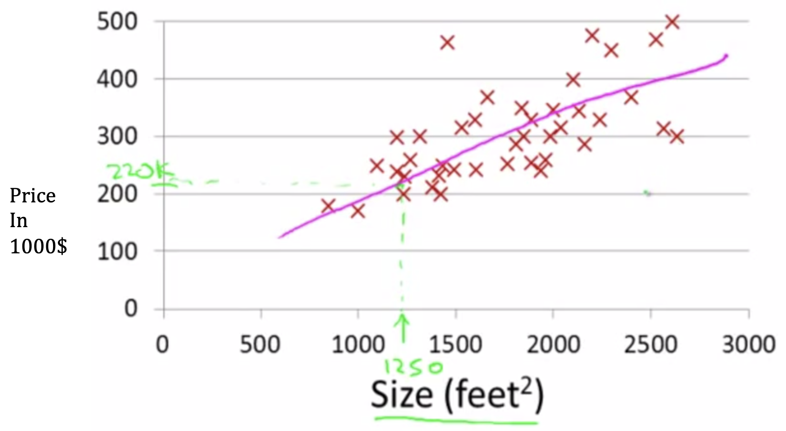
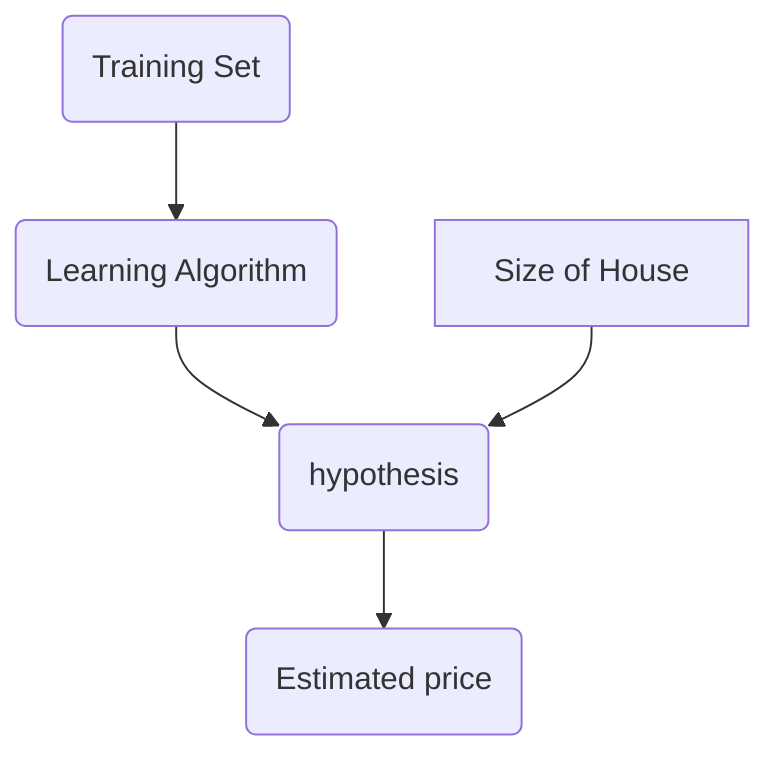

## Model Representation

Suppose you have a friend that is looking to sell a house that is about 1,250 sq. feet.  Based on the observations shown above with red x’s – which do not contain a sale price for a house of 1250 sq. feet – you could make a reasonable guess that the price would be $220,000.00 for the house by drawing a straight line through the data, and deriving the price from the size using it.

* This is an example of supervised learning, where we’re given the “right answer” (e.g. price) for each example (e.g. square footage) in the data.  

* This is also an example of a regression problem since we’re trying to predict continuous, real-valued output given our input data.

### Training Sets

Given a set of data, we'd like to train our algorithm how to predict prices for houses. A training set has a few characteristics: 

* $m$: the number of training examples
* $x$'s: the input variables or "features"
* $y$'s: the output variables or "targets"
* $(x,y)$: a single training parameter, or row
* $(x^{i}, y^{i})$: a specific training example, the "ith" training example

For the above example, the housing prices we’ve been given are considered our “training set.” 

| X (size in sq ft) | Y (price in $1000s) |
| :---------------: | :-----------------: |
|       2104        |         460         |
|       1416        |         232         |
|       1534        |         315         |
|        ...        |         ...         |

A training set is fed to a learning algorithm which will output a function which (by convention is known as an "hypothesis"), that will take an input as a parameter $x$ and will output an estimated value of $y$:

$h => f(x) -> y$

Representing $h$:

 $h_{\theta}(x) = \theta_{0} + \theta_{1}$

Sometimes shorthand as $h(x)$

This function is predicting that $h(x)$ is a linear function of $x$ (i.e. $\theta_{0} + \theta_{1}$).  A linear function is a simple starting point, building block. 

#### Why use a linear function?

Sometimes we may want to use a more complex function, but the linear function is a building block to understand how to derive and apply more complicated scenarios.

Because this model is only dependent on a single variable (e.g.: $x$), it is known as Linear Regression with one variable – or “univariate linear regression.”

By inserting different values (e.g. parameters) into the hypothesis, we are able to understand better how well the function fits to the training set.
