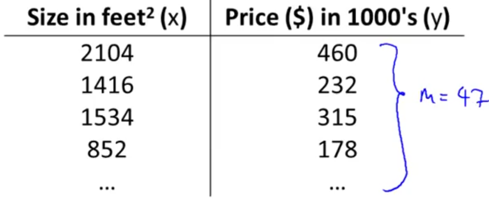
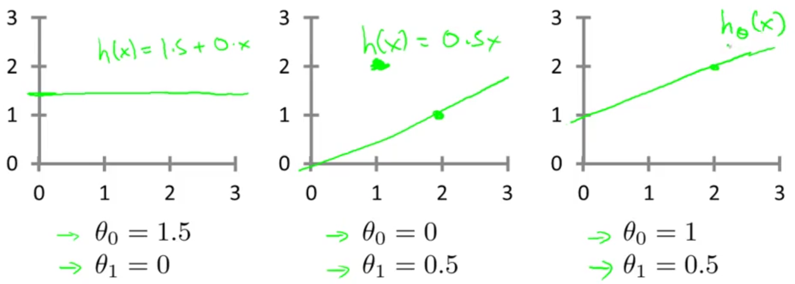
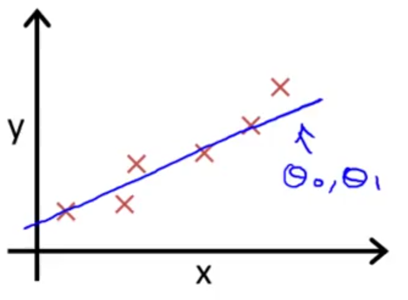

## Cost Function [^4]

We can measure the accuracy of our hypothesis function by using a **cost function**  This takes an "average" difference of all the results of the hypothesis with inputs from $x$'s and the actual output $y$'s — the difference between the predicted and the actual values.

Given this training set:

And the hypothesis:
$$
h_{\theta}(x) = \theta_{0} + \theta_{1}x
$$
The parameters of the model are represented by the two theta values. With different choices of these parameters, we get different hypothesis function values. Example: note the effect of changing the values of $\theta_{0}$ and $\theta_{1}$ affect the curves in each graph:

In Linear Regression, using this training set, we want to come up with values for the theta variables to create a straight line corresponds to a straight line that fits the data set. So, how do we do this?

The idea is that we choose $(\theta_{0}, \theta_{1})$ so that $h_{\theta}(x)$ is close to $y$ for our training examples $(x, y)$, which would result in reasonably active predictions.

More formally, we want to minimize $(\theta_{0}, \theta_{1})$ and we want $(h(x) - y)^2$ to be small

* We want the squared difference between our hypothesized value of a house ($h(x)$) and the actual value of a house ($y$) to be small.
* We also want to sum over the entire training set, to validate that the squared difference for each of the training examples is as close as possible.

$$
J(\theta_{0}, \theta_{1}) = \frac{1}{2m} \times \sum^{m}_{i=1} (h_{\theta }(x^{i})\  -\  y^{i})^{2}\
$$

In short, find me the values of $(\theta_{0}, \theta_{1})$ so that the average of the sum of the square errors between my predictions on the training set minus the actual values of the houses on the training set is minimized.  $J$ is known as the _cost function_, or the *squared error function*.

So, given an hypothesis function , we estimate the cost (i.e. the divergence from the existing dataset) by subtracting the value for  from the result for , and then squaring the difference.  This should be summed for each element in the training set, and then divided by .  The result should be as close to zero as possible.