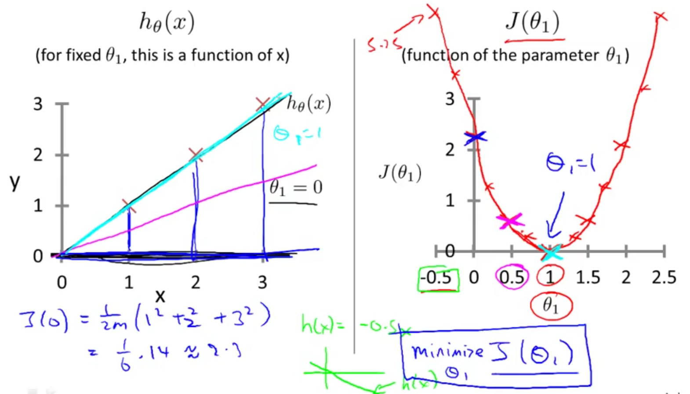

## Cost Function Intuition [^5]

### Recap of Cost Functions

* We want to fit a straight line to our data
* We try different parameters to get to get different lines to model the data
* We use a cost function to validate the prediction to find the best fit.

For thsi we will be working with a simplified hypothesis function. To simplify gaining an intuitive understanding of the Cost Function consider a circumstance where $\theta_{0} = 0$.

Given the hypothesis:
$$
h_{\theta}(x) = \theta_{0} + \theta_{1}x
$$
We want to simplify this, by assuming $\theta_{0} = 0$, so:
$$
h_{\theta}(x) = \theta_{1}x
$$
Let's try to understand better the cost function with this simpler hypothesis.

The two key functions we want to understand are:

1. The hypothesis function $h_{\theta}(x)$, 
   * for fixed value of $\theta_{1}$ this is a function of $x$.
   * For our training data then, this is a function of the size of the house being sold. "Given a size of the house, predict the price of the house."
2. The cost function $J(\theta_{1})$
   * function of the parameter $\theta_{1}$
   * $\theta_{1}$ controls the slope of the line.

Our objective is to get the best possible line. The best possible line will be such so that the average squared vertical distances of the scattered points from the line will be the least. Ideally, the line should pass through all the points of our training data set. In such a case, the value of $J(\theta_0, \theta_1)$ will be 0.

### Minimizing the Cost Function

Each value of $\theta_{1}$ corresponds to a different hypothesis, or different straightline fit.  For each value we can derive a different value for $J(\theta_{1})$,  we can then use these different values for $J(\theta_{1})$ to plot out a curve like so:

The optimization objective for a learning algorithm is to choose the value of $\theta_{1}$ that minimizes $J(\theta_{1})$. Turns out that as $J(\theta_{1})$ approaches zero, the hypothesis becomes a better fit for the data because the squared differences between $h(x)$ (the hypothesized result for the size of the house) and $y$ (actual prices for houses sold at a given size) approaches zero.

The relationship between $h(x)$ and $J(\theta_{1})$ is shown in this screenshot:

The process of mininmizing using the cost function $J$ shows us that the best fit is where $\theta_{1}$ is equal to `1`. This is confirmed in the left side of the screenshot where we see that the result of plotting $h_{\theta}(x) = \theta_{1}x$ with a value of $\theta_{1}$ = 1 matches very closely to the original dataset of: $(0, 0), (1, 1), (2, 2)$