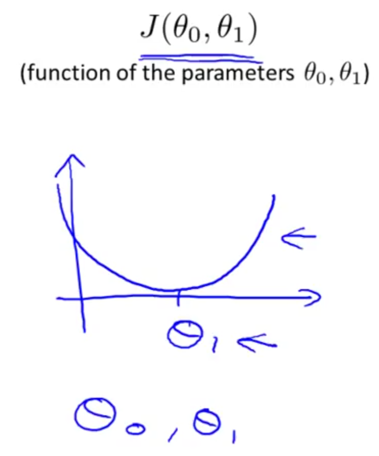
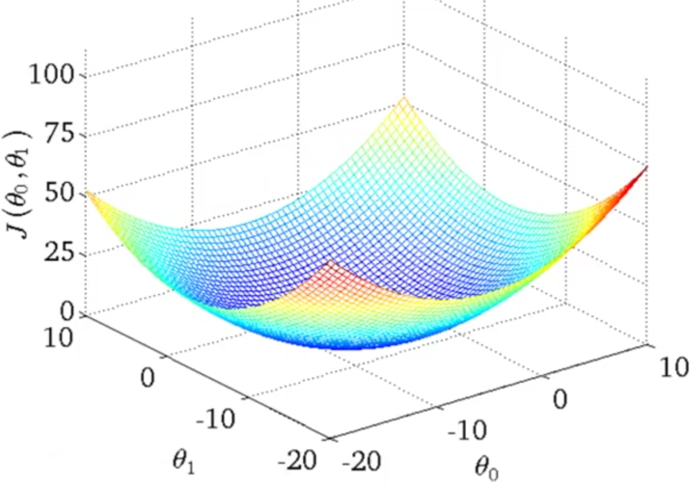

## Cost Function Intuition II

### Background

| Hypothesis        | $h_{\theta}(x)=\theta_{0}+\theta_{1}x$                       |
| ----------------- | ------------------------------------------------------------ |
| **Parameters**    | $\theta_{0},\theta_{1}$                                      |
| **Cost Function** | $J(\theta_{0},\theta_{1})=\frac{1}{2m} \times \sum^{m}_{i=1} (h_{\theta }(x^{i})\  -\  y^{i})^{2}$ |
| **Goal**          | Minimize $J(\theta_{0},\theta_{1})$                          |

In comparison to the last lesson, we will not zero out $\theta_{0}$.  In the last lesson, because we only used one of the two parameters, we were able to plot out the cost function on a two dimensional axis:

In that curve, we minimized the cost function and could easily see it as the lowest point on the curve.

However, in this lesson we're keeping both parameters, so we wil need a different plat if we want to visualize the cost function across a range of both parameters.  Here we see a 3D surface plot that illustrates this:

We see the two theta parameters across the bottom, and the height of the surface above those indicates the value of the cost function.  This bowl like shape illustrates the mimimal values of $\theta_{0},\theta_{1}$ to reach our goal of minimizing the cost function.

Also illustrated in this lesson were contour plots, which didn't make a lot of sense to me.
