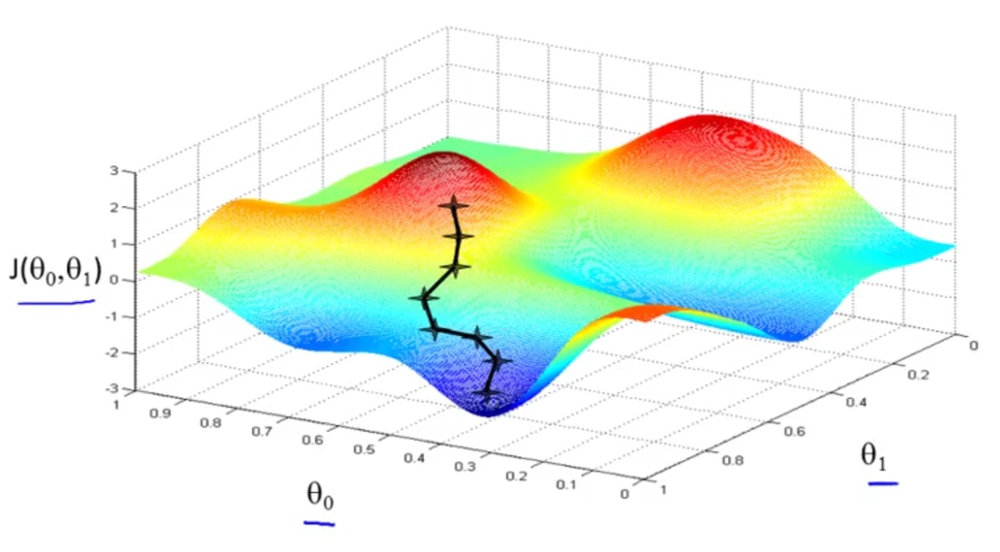

# Gradient Descent

A more general algorithm for minimizing the cost function, used elsewhere besides the cost function for linear regression.

## Overview

So we have our hypothesis function and we have a way of measuring how well it fits into the data (a cost function). Now we need to estimate the parameters in the hypothesis function. That's where gradient descent comes in.

Imagine that we graph our hypothesis function based on its fields $\theta_{0}$ and $\theta_{1}$ (actually we are graphing the cost function as a function of the parameter estimates). We are not graphing $x$ and $y$ itself, but the parameter range of our hypothesis function and the cost resulting from selecting a particular set of parameters.

We put $\theta_{0}$ on the x axis and $\theta_{1}$ on the y axis, with the cost function on the vertical z axis. The points on our graph will be the result of the cost function using our hypothesis with those specific theta parameters. The graph below depicts such a setup.

We will know that we have succeeded when our cost function is at the very bottom of the pits in our graph, i.e. when its value is the minimum.  The red arrows show the minimum points in the graph.

## Setup

Given some function $J(\theta_{0}, …, \theta_{n})$, we want $\min_{\theta_{0},…,\theta_{n}} J(\theta_{0}, …,\theta_{n})$

### Outline

Gradient Descent will work with arbitrary number of parameters.  For this we will work with two parameters, with both values initialized to a value of 0.

* Start with some $\theta_{0}, \theta_{1}$
* Keep changing $\theta_{0}, \theta_{1}$ to reduce $J(\theta_{0}, \theta_{1})$ until we hopefully end up at some minimum

### Intuition

The technique of Gradient Descent is to start with some arbitrary values for $\theta_{0}, \theta_{1}$ and then keep changing them to reduce $J(\theta_{0}, \theta_{1})$ until (hopefully) we arrive at some minimum value (possibly a local minimum). Gradient descent has the property that, depending on your initial starting point, you may end up with a different minimum, a second _local optimimum_.

This graph illustrates the progressive changes in $\theta_{0}, \theta_{1}$ until it arrives at a local minimum in the dark blue region.

### Method

Gradient descent algorithm: repeat until convergence 
$$
\{ \\
    \theta_{j} :=\theta_{j} -\alpha \frac{\partial }{\partial \theta_{j} } J(\theta_{0} ,\theta_{1} )\  \  (for\  j=0\  and\  j=1)\\
\}
$$

$\alpha$ : refers to the learning rate, controls how big a step we take when going downhill and affects the magnitude of change of the values to $\theta_{j}$; large, is aggressive steps and small are little baby steps. 
