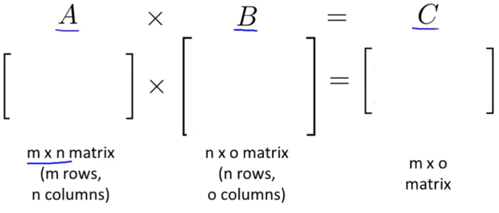

## Matrix-matrix Multiplication

Suppose we have two matrices that we'd like to multiply together:
$$
\begin{bmatrix}
1 & 3 & 2 \\
4 & 0 & 1
\end{bmatrix}
\times
\begin{bmatrix}
1 && 3 \\
0 && 1 \\
5 && 2
\end{bmatrix}
= \ ?
$$
We start by pulling out a vector of the first column of the second matrix and multiplying their product:
$$
\begin{bmatrix}
1 & 3 & 2 \\
4 & 0 & 1
\end{bmatrix}
\times
\begin{bmatrix}
1 \\
0 \\
5
\end{bmatrix}
= \ 
\begin{bmatrix}
11 \\
9
\end{bmatrix}
$$
Then pull out the second column of the second matrix and calculating their product:
$$
\begin{bmatrix}
1 & 3 & 2 \\
4 & 0 & 1
\end{bmatrix}
\times
\begin{bmatrix}
3 \\
1 \\
2
\end{bmatrix}
= \ 
\begin{bmatrix}
3\times1+3\times1+2\times2 \\
4\times3+0\times1+1\times2
\end{bmatrix}
= \ 
\begin{bmatrix}
10 \\
14
\end{bmatrix}
$$
Then take these two vector results and combine them to provide the product of the two matrices:
$$
\begin{bmatrix}
11 && 10 \\
9 && 14
\end{bmatrix}
$$

### Details of this Calculation

To examine this more closely:

* You can only multiply matrices whose dimensions match — the number of columns in the first matrix must match the number of rows in the second matrix.
* The product is an $m \times o$ matrix. Matrix-vector multiplication is a special case where $o = 1$

* Algorithm: the $i^{th}$ column of the matrix $C$ is obtained by multiplying $A$ with the $i^{th}$ column of $B$. (for $i=1,2,…,o$)

## Application to Hypothesis Function

Let say that given a set of 4 house sizes whose price we'd like to predict:
$$
sizes = 
\begin{bmatrix}
    2104 \\
    1416 \\
    1534 \\
     852
\end{bmatrix}
$$
And then 3 competing hypotheses on how to predict the prices for each based on their size:

1. $h_{0}(x) = -40 + 0.25x$
2. $h_{0}(x) = 200 + 0.1x$
3. $h_{0}(x) = -150 + 0.4x$

When set up, we have the following multiplication expression:
$$
\begin{bmatrix}
    1 & 2104 \\
    1 & 1416 \\
    1 & 1534 \\
    1 &  852
\end{bmatrix}
\times
\begin{bmatrix}
-40 && 200 && -150 \\
0.25 && 0.1 && 0.4
\end{bmatrix}
=
\begin{bmatrix}
486 && 410 && 692 \\
314 && 342 && 416 \\
344 && 353 && 464 \\
173 && 285 && 191
\end{bmatrix}
$$
This resulting columns in the product matrix is the set of predictions for each of the corresponding hypothesis functions. 