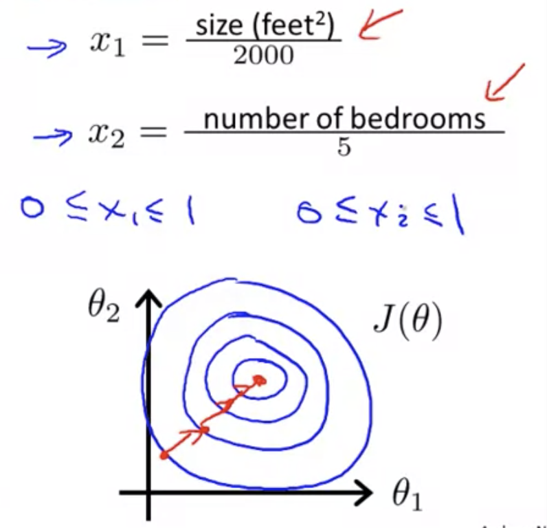

## Gradient Descent in Practice: Feature Scaling

We can speed up gradient descent by having each of our input values in roughly the same range. This is because $\theta$ will descend quickly on small ranges and slowly on large ranges, and so will oscillate inefficiently down to the optimum when the variables are very uneven.

Example if you have two features, and they are off scale from one another, then gradient descent will take a long time to reach the global minimum:

Because you have size in the scale of 1000s and num of bedrooms in scale of 1s, the contours become tall and skinny.  This leads to a situation where gradient descent oscillates back & forth before it reaches the minimum.

A way to deal with that would be to scale the features such that they end up on a similar scale:

Get every feature into approximately a range from (ideally) $-1 \leq x_i \leq 1$.  Generally, the ranges should be within a narrow range — not too small and not too big:
$$
\begin{cases}0\leq \  x_{i}\leq \  3&good\\ -2\leq x_{i}\leq 2&good\\ -100\leq x_{i}\leq 100&not\  good\\ -0.0001\leq x_{i}\leq 0.0001&not\  good\end{cases} 
$$
Generally speaking, -3 to 3 or -1/3 to 1/3 is an acceptable range. These aren't exact requirements; we are only trying to speed things up. The goal is to get all input variables into roughly one of these ranges, give or take a few.

## Feature Scaling

Feature scaling involves dividing the input values by the range (i.e. the maximum value minus the minimum value) of the input variable, resulting in a new range of just 1.

## Mean Normalization

Mean normalization involves subtracting the average value for an input variable from the values for that input variable resulting in a new average value for the input variable of just zero.

## Implementation of Feature Scaling

To implement both of these techniques, adjust your input values as follows.

Replace $x_i$ with the average value to make features have approximately zero mean (does not apply with $x_0=1$).

Example:
$$
x_1=\frac{size-1000}{2000} \\
x_2=\frac{numBedrooms-2}{5}
\\
-0.5\leq x_1\leq0.5,\\
-0.5\leq x_2\leq0.5
$$
Generally, replace feature $x_1$ with $\frac{x_i-\mu_i}{s_1}$ where $\mu_1$ is the average value of $x_1$ and $s_1$ is the range (max-min) or the standard deviation of the dataset.
