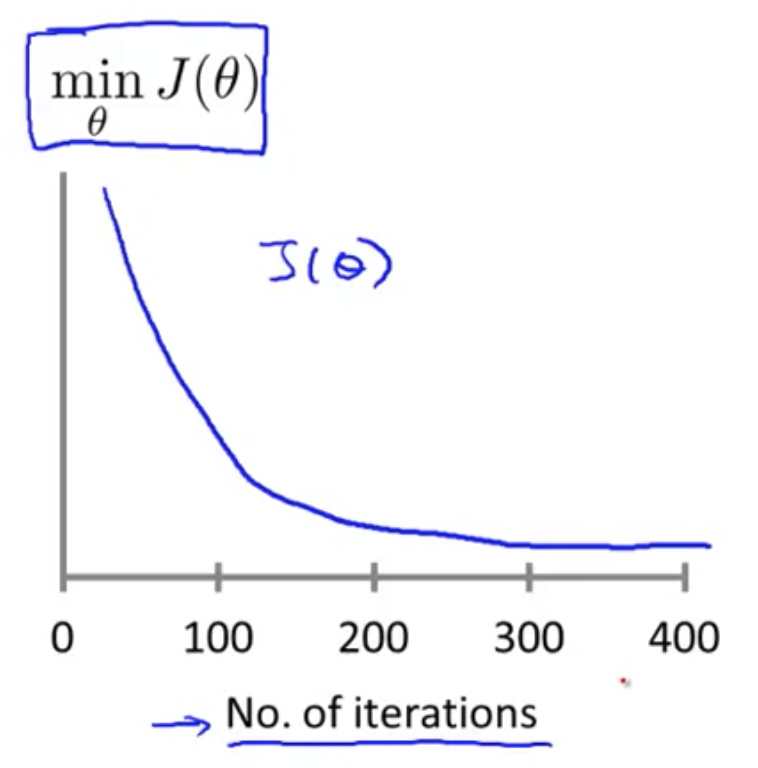
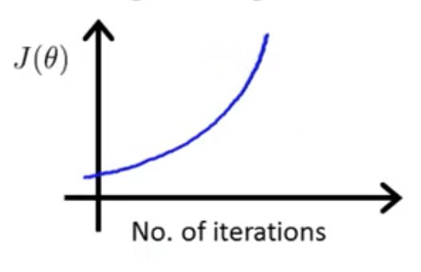
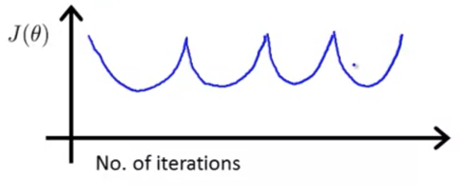
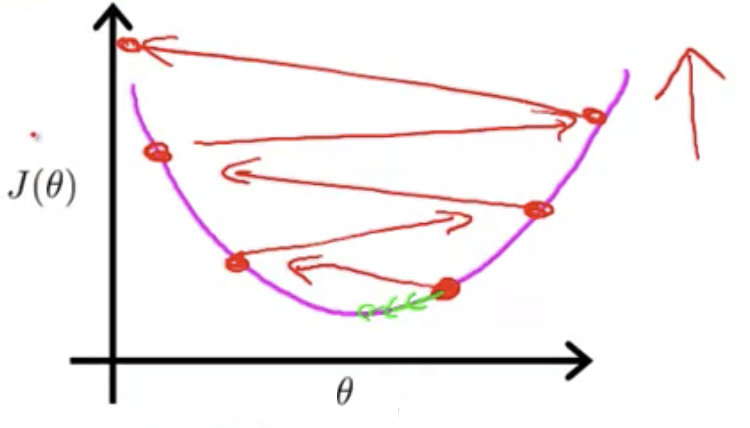

## Gradient Descent in Practice: Learning Rate [^19]

Given the gradient descent rule $\theta_{j} :=\theta_{j} -\alpha \frac{\partial }{\partial \theta_{j} } J(\theta )$ this lesson provides the following:

* Provide tips on making sure that gradient descent is working correctly.
* How to choose the learning rate $\alpha$

### Checking Progress of Gradient Descent

Plot the value of $J(\theta)$ against hte number of iterations.  $J(\theta)$ should decrease after every iteration.  At some point the curve flattens out, and it's clear that some degree of convergence has been reached.

The number of iterations that convergence may take varies widely and is difficult to determine in advance.

#### Automatic Convergence Test

Come up with an algorithm that can tell you when convergence arrives.

Declare convergence if $J(\theta)$ decreases by less than some threshold (e.g. $10^{-3}$) in one iteration, though finding that threshold may be difficult to arrive at.

Typically easier to just use a plot, as it can give you indications that gradient descent is not working.

### Making Sure that Gradient Descent is Working Correctly

If a plot $J(\theta)$ is not showing convergence over the number of iterations, then it's clear that gradient descent is not working.

To address this you should use a smaller learning rate, as what's happening is that gradient descent is oscillating and overshooting the minimum.

For sufficiently small $\alpha$, then $J(\theta)$ should decrease on every iteration. But if $\alpha$ is too small, gradient descent will be slow to converge.  If it's too large, $J(\theta)$ may not decrease on every iteration, converging eventually or not at all.

To choose $\alpha$, try a range of values (e.g. 0.001, 0.003, 0.01, 0.03, 0.1, 0.3 1, etc), where each value is about 3x of the other.
