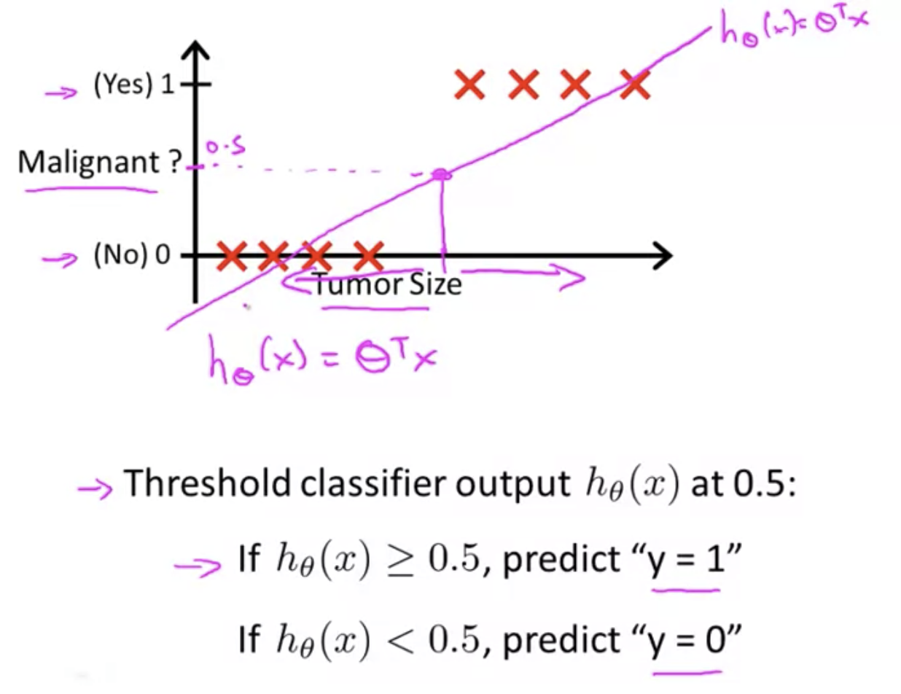
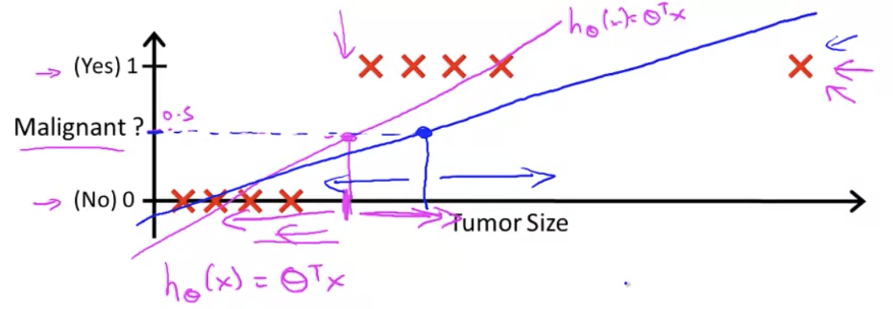

## Classification

Classification is predicting what bucket a given answer should fall in, as opposed to a range of values. For example: is this email message spam or not? In all of these problems we are trying to predict is $y$ which is taking on a value of $0$ or $1$, the "negative" or "positive" classes:
$$
y\in\left\{0,1\right\}^{0:\ "negative\ class"}_{1:\ "positive class"}
$$
We will start with classification problems where there're only two cases, later we will take on multi-class classification problems.

### Logistic Regression

Logistic regression is one of the most popular algorithms for doing classification.

To attempt classification, one method is to use linear regression and map all predictions greater than 0.5 as a 1, and all less than 0.5 as a 0.  

However, this method doesn't work well because classification is not actually a linear function.  In this example here, you can see if there happens to be one extreme point in the training data, it will force the midpoint over to the right:

The classification problem is just like the regression problem except that the values we now want to predict take on only a small number of discrete values.

Logistic regression is an algorithm that we can use for classification that will guarantee that the results of our hypothesis satisfy the expression $0\leq h_\theta(x)\leq1$.

