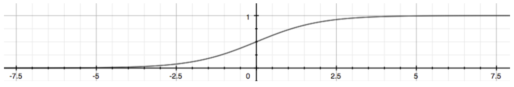

## Hypothesis Representation

When dealing with classification problems where $y\in{0,1}$ we want our hypothesis function $h_\theta(0)$ to satisfy $0\leq h_\theta(0)\leq1$. This is accomplished by plugging $\theta^T$ into the "Logistic Function" or "Sigmoid Function".  

When using linear regression our hypothesis took the form: $h_\theta(x)=\theta^Tx$; for logistic regression, we name this $g$ and transform it using the sigmoid function:
$$
\ z=\theta^Tx \\
\ \ \ \ \ \ \ \ \ \ \ \downarrow \\
h_\theta(x)=g(\theta^Tx)\\
\downarrow \\
g(z)=\frac{1}{1+e^{-z}} \\
\downarrow \\
h_\theta(x)=\frac{1}{1+e^{-\theta^Tx}}
$$

The function $g(z)$ maps any real number to the (0, 1) interval, making it useful for transforming an arbitrary-valued function into a function better suited for classification.

$h_\theta(x)$ will give us the *probability* that our output is 1. For example $h_\theta(x)=0.7$ gives us a probability of 70% that our output is 1; the probability that our output is 0 is the complement of that, e.g. 30%.