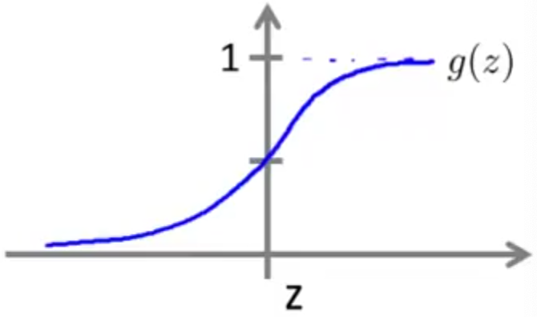
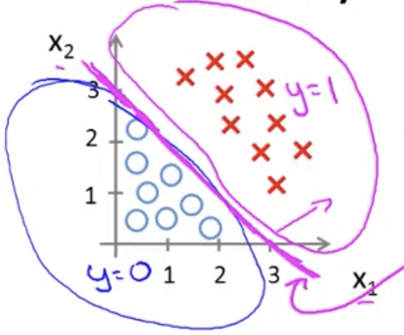
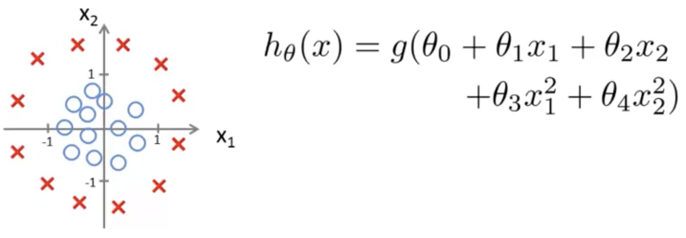
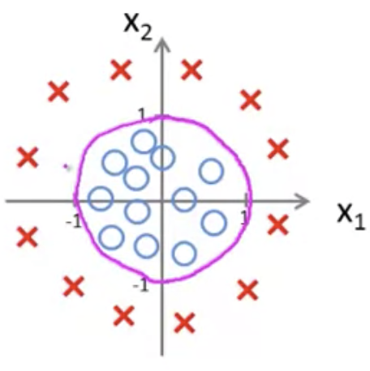

## Decision Boundary [^25]

Previously we learned that our hypothesis function is defined differently for categorization problems:

$$
h_\theta(x)=g(\theta^Tx)=p(y=1|x:\theta)
$$

We define the hypothesis function in terms of $g$ such that it gets plotted as a sigmoid function:

$$
g(z)=\frac{1}{1+e^{-z}}
$$

When plotted this way all values are placed either above or below a threshold value (i.e. 0.5), with a probability that it's closer or further away from 1 and 0:

In order to classify a value as a discrete 0 or 1 result, we can translate the output of the hypothesis function as follows:

$$
h_\theta(x)=\ge0.5\rightarrow y=1\\
h_\theta(x)=\lt0.5\rightarrow y=0
$$

If the input $z$ to the logistic function ($g(x)$) is greater than or equal to zero, its output is greater than or equal to 0.5:

$$
g(z)\ge0.5\\
when\ z\ge0
$$

Given $g(z)$ is plotted using a sigmoid function as follows $\frac{1}{1+e^{-z}}$, then:

$$
if\ z=0,\ then\ e^0=1\ \Rightarrow g(z)=1/2\\
z\rightarrow\infty,\ e^{-\infty}\rightarrow0\Rightarrow g(z)=1\\
z\rightarrow-\infty,\ e^{\infty}\rightarrow\infty\Rightarrow g(z)=0
$$

So if our input to $g$ is $\theta^TX$, then that means:

$$
h_\theta(x)=g(\theta^Tx)\ge0.5\\
when\ \theta^Tx\ge0
$$

From these statements we can now say:

$$
\theta^Tx\ge0\Rightarrow y=1\\
\theta^Tx\lt0\Rightarrow y=0
$$

The **decision boundary** is the line that separates the area where y = 0 and where y = 1; in this illustration it is shown as the diagonal magenta line, where everything above is $y=1$ and the area below is $y=0$:

The decision boundary is not a property of the training data, but of the hypothesis function.

### Non-linear Decision Boundaries

A more complex example which has both positive and negative examples in the training set.  The hypothesis has two additional features $\theta_3$ & $\theta_4$:

And we choose a set of parameters like this:

$$
\begin{bmatrix}-1\\ 0\\ 0\\ 1\\ 1\end{bmatrix}
$$

Given that information we say that our hypothesis will predict $y=1$ whenever $-1+x^2_1+x^2_2\ge0$.  That can be rephrased as:

$$
x^2_1+x^2_2\ge1
$$

Thus predicting a value of 1 whenever $x^2_1+x^2_2$.  This is an equation for a circle of radius 1 centered on the origin (the magenta line in this illustration), i.e. the decision boundary:

