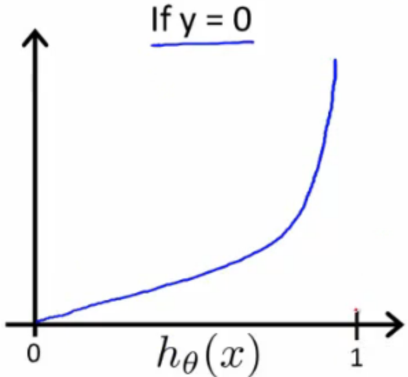

## Cost Function [^26]

The cost function we've been using for linear regression will not work well with logistic regression because the logistic function will cause the output to be wavy, leading to many local optima.  

The cost function for logistic regression will look like this:
$$
J(\theta)=\frac{1}{m}\sum^m_{i=1}Cost(h_\theta(x^{(i)}),y^{(i)})
$$
Where:

$Cost(h_\theta(x),y)=-log(h_\theta(x))$                 if $y=1$

$Cost(h_\theta(x),y)=-log(1-h_\theta(x))$          if $y=0$

When $y=1$, we get the following plot for $J(\theta)$ vs $h_\theta(x)$:

And, when $y=0$ we get ths plot for $J(\theta)$ vs $h_\theta(x)$:

Note some inferences we can make:
$$
\begin{cases}Cost(h_{\theta }(x),y)=0&if\  h_{\theta }(x)=y\\ Cost(h_{\theta }(x),y)\rightarrow \infty &if\  y=0\  and\  h_{\theta }(x)\rightarrow 1\\ Cost(h_{\theta }(x),y)\rightarrow \infty &if\  y=1\  and\  h_{\theta }(x)\rightarrow 0\end{cases} 
$$
An important implication of the second two cases is that the hypothesis function has an infinite cost if its result does not agree with the actual result (as captured in the training data by $y$). This penalizes the learning algorithm with a very large cost if it's wrong.  In the first case, there's zero cost if the hypothesis agrees with the training data, as we would expect as the hypothesis then matches reality.