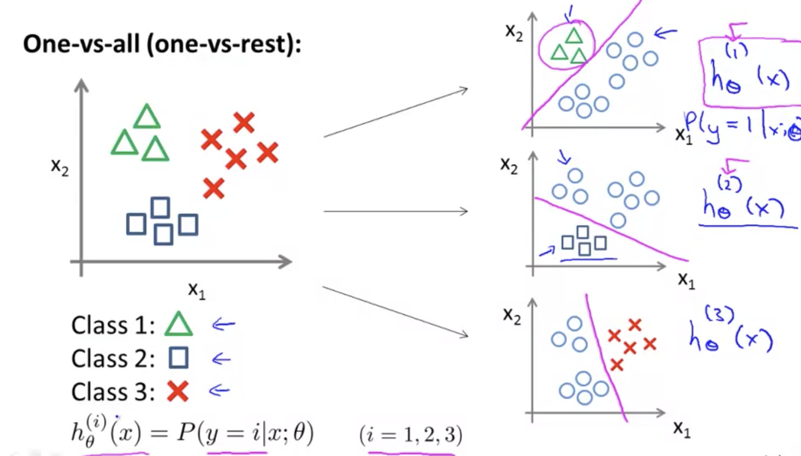

## Multiclass Classification [^30]

Multiclass Classification: Automatically tagging emails into different categories. So instead of $y=\{0, 1\}$ we expand the definition to $y=\{0, 1,…n\}$.

Since $y=\{0,1,…,n\}$, we divide our problem into $n+1$ binary classification problems; in each one we predict the probability that $y$ is a member of one of our classes.

### One vs. All Classification

In other words, we are basically choosing one class and then lumping all the others into single second class.  We do this repeatedly, applying binary logistic regression to each case, and then use the hypothesis that returned the highest value as our prediction.

 First we would train a logistic regression classifier $h^{(i)}_\theta(x)$ for each class $i$ to predict the probability that $y=i$. Then, on a new input $x$, to make a prediction, we run all $n$ classifiers on $x$ and pick the class $i$ that maximizes $\max_{i}h^{(i)}_\theta(x)$.

