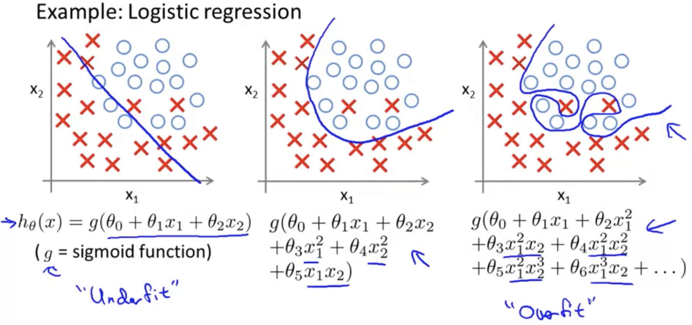

## The Problem of Overfitting [^31]

Consider a case where a linear hypothesis function does not fit the data very well (known as "underfitting").  If the data doesn't really lie on a straight line, a linear function will not be very good at predicting $y$ because the data lies outside the function much of the time.

So for example, the leftmost curve shows a linear function $y=\theta_0+\theta_1x$ plotted against some data.  As can be seen, it doesn't fit the data very well.

Take the centermost figure, where we added an extra feature $x^2$, and plot $y=\theta_0+\theta_1x+\theta_2x^2$, which provides a slightly better fit.  Naively it might seem that if we add yet more features we would get a better fit; the rightmost figure is the result of fitting a $5^{th}$ order polynomial: $y=\sum^{5}_{j=0}\theta_jx^j$.  Though this passes through all of the training data perfectly, it would not necessarily be a good predictor.  This is an example of "overfitting".

If we have too many features, the learned hypothesis may fit the training set very well, but fail to generalize to new examples & predict based on them.

Also known as "high bias", _underfitting_ is when the form of our hypothesis function $h$ maps poorly to the trend of the training data. It is usually caused by a function that is too simple or uses too few features.  At the other extreme, _overfitting_, or "high variance", is caused by a hypothesis function that fits the available data but does not generalize well to predict new data. It is usually caused by a complicated function that creates a lot of unnecessary curves and angles unrelated to the data.

These terms apply to both linear and logistic regression.

We may have a lot of features in the training data, but not enough training data.

There are two main options to address the issue of overfitting:

1. Reduce the number of features.
   * Manually select which features to keep.  This could help, but this could also be useful information that you're throwing away.
   * Use a model selection algorithm (addressed later).
2. Regularization
   * Keeps all the features, but reduce the magnitude/values of parameters $\theta_j$.
   * Regularization works well when we a lot of slightly useful features, each of which contributes to predicting the value of $y$.
