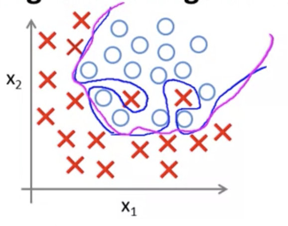
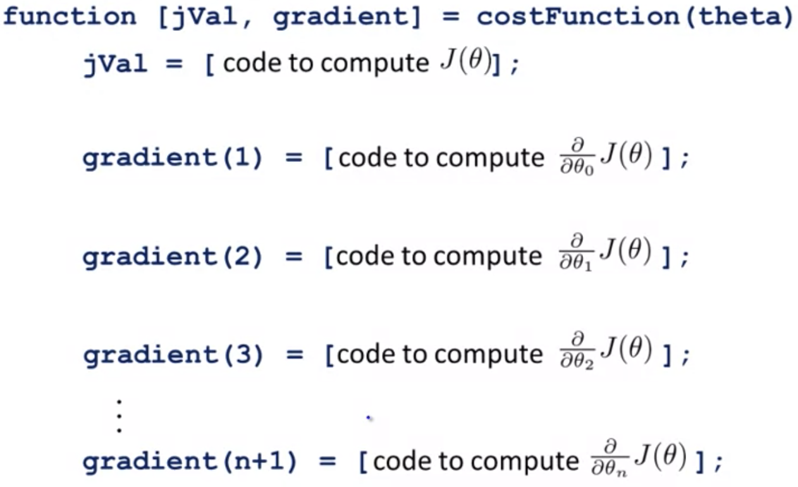

## Regularization: Logistic Regression [^34]

As with linear regression, we can regularize logistic regression in order to avoid overfitting.

In the following screenshot the regularized function, shown in pink, is less likely to overfit than the non-regularized function shown in blue.

Gradient descent for logistic regression is the same as for linear regression, as follows:
$$
\text{Repeat}\begin{cases}\theta_{0}:=\theta_{0}-\alpha\cdot\frac{1}{m} \sum^{m}_{i=1}(h_{\theta }(x^{(i)})-y^{(i)})x^{(i)}_{0}&j=0\\\theta_{j} :=\theta_{j}-\alpha\cdot\frac{1}{m}\sum^m_{i=1}(h_\theta(x^{(i)})-y^{(i)})x^{(i)}_j+\frac{\lambda}{m}\theta_j&j=1,2,3,...n\end{cases}
$$
Except recall that with logistic regression out hypothesis function $h_\theta(x)$ is equal to:
$$
\frac{1}{1+e^{-\theta^Tx}}
$$

### Cost Function

Recall that our cost function for logistic regression is as follows:
$$
J(\theta )=-\frac{1}{m} \sum^{m}_{i=1} \left[ y^{(i)}\  log(h_{\theta }(x^{(i)}))+(1-y^{(i)})\  log(1-h_{\theta }(x^{(i)))}\right]
$$
We can regularize that function by adding this term to the end:
$$
\frac{\lambda}{2m}\sum^n_{j=1}\theta^2_j
$$
Resulting in the following:
$$
J(\theta )=-\frac{1}{m} \sum^{m}_{i=1} \left[ y^{(i)}\  log(h_{\theta }(x^{(i)}))+(1-y^{(i)})\  log(1-h_{\theta }(x^{(i)))}\right]+\frac{\lambda}{2m}\sum^n_{j=1}\theta^2_j
$$
This second sum, shown in $(2)$ above **explicitly excludes** the bias term $\theta_0$.  In other words, note that the vector $\theta$ is zero-indexed, holding $n+1$ values from $\theta_0$ through $\theta_n$, and this sum explicitly skips $\theta_0$ by running from $1$ to $n$, thus skipping $0$.

### Advanced Optimization

Vectors are zero based, but octave indexes from one.

This cost function gets passed as follows `fminunc(@costFunction,...)`

These parameters are defined as follows:

* `jVal`:

$$
J(\theta)=-\frac{1}{m} \sum^{m}_{i=1} \left[ y^{(i)}\  log(h_{\theta }(x^{(i)}))+(1-y^{(i)})\  log(1-h_{\theta }(x^{(i)))}\right]+\frac{\lambda}{2m}\sum^n_{j=1}\theta^2_j
$$

* `gradient(1)`:

$$
\frac{\partial}{\partial\theta_0}=\frac{1}{m}\sum^m_{i=1}(h_\theta(x^{(i)})-y^{(i)})x^{(i)}_0
$$

* `gradient(2)`:

$$
\frac{\partial}{\partial\theta_0}=\frac{1}{m}\sum^m_{i=1}(h_\theta(x^{(i)})-y^{(i)})x^{(i)}_0+\frac{\lambda}{m}\theta_1
$$

* `gradient(3)`:

$$
\frac{\partial}{\partial\theta_0}=\frac{1}{m}\sum^m_{i=1}(h_\theta(x^{(i)})-y^{(i)})x^{(i)}_0+\frac{\lambda}{m}\theta_2
$$
