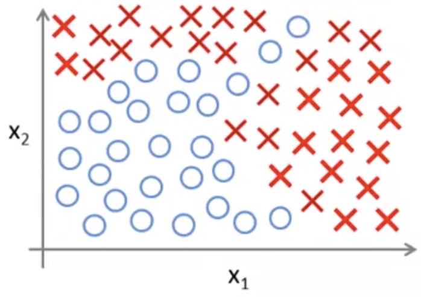
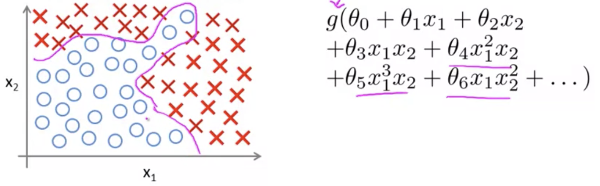

## Motivations: Non-Linear Hypotheses [^35]

### Why do we need Neural Networks?

For many machine learning problems the number of features will be very large.  For example, training a model to recognize a car in an image.

When working with supervised learning on a classification problem that is non-linear such as this:

We have learned so far that when working with logistic regression we could use a complex quadratic equation that could model a line that can fit that data:

This method works well when we have only two features $x_1$ and $x_2$, but if we have a more interesting problem this approach doesn't scale well.  For exampfale if we had 100 features, if we ordered all of the quadratic terms we'd approach thousands of quadratic terms as parameters.

The number of quadratic features grows exponentially as roughly $O(n^2)$, and the count of features would be in the neighborhood of $\frac{n^2}{2}$.

We could, perhaps, only include a subset of the features but this is not enough features and would not fit a complex dataset above.

For example if we were to sample images so that a model can predict whether or not another image had a car on it using, say, 50x50 pixel samples from the images the feature space would be calculated as follows.

50x50 pixel images $\rarr$ 2500 pixels, $\therefore n=2500\ \text( 7500\ if\ RGB)$ .
$$
X = \begin{bmatrix}pixel\  1\  intensity\\ pixel\  2\  intensity\\ \vdots \\ pixel\  2500\  intensity\end{bmatrix} 
$$
This would result in roughly 3,000,000 features, as follows:
$$
\frac{n^2}{2}=\frac{2500^2}{2}=3,125,000
$$
