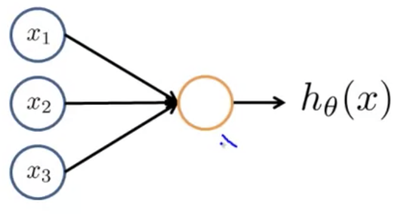
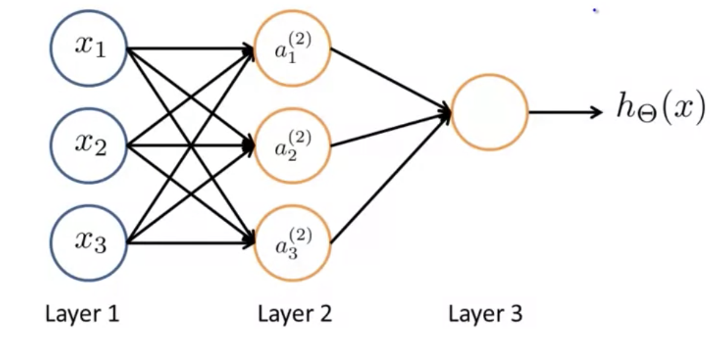
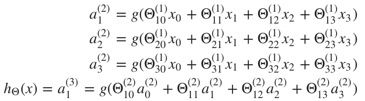

## Neural Networks: Model Representation I

At a very simple level a neuron is basically a computational unit that takes inputs from "dendrites" as electrical "spikes" which are channeled to outputs known as "axons."  Dendrites in our model are input features $x_1…x_n$ and the output is the result of our hypothesis function.  You can think of our logistic unit like this:

These inputs and parameters are a matrix, where the first element $x_0$ is known as the "bias unit", and is always one:
$$
x=\begin{bmatrix}x_{0}\\ x_{1}\\ x_{2}\\ x_{3}\end{bmatrix}\\
\theta=\begin{bmatrix}\theta_{0}\\ \theta_{1}\\ \theta_{2}\\ \theta_{3}\end{bmatrix}
$$

In neural networks, we use the same hypothesis funtion as in classification: $\frac{1}{1+e^{-\theta T_x}}$. We sometimes call it an artifical neuron with a sigmoid (logistic) "activation" function $g(z)=\frac{1}{1+e^{-z}}$.  And, our "theta" parameters are sometimes called "weights".

A **neural network** is just a group of these different neurons strung together:

Layer 1 is referred to as the "input layer" and Layer 3 is the "output layer."  Layer 2 is known as the "hidden layer".  There may be more than one hidden layer, any layer that's not the input nor the output is considered hidden.

### Explanation of Computation in a Neural Network

We label these intermediate "hidden" layer nodes as, for example for Layer 2 with $n$ units: $a^2_0…a^2_n$ and call them "activation units."
$$
a^{(j)}_i=\text{"activation" of unit i in layer j}\\
\theta^{(j)}=\text{matrix of weights controlling function mapping from layer j to layer j+1}
$$
By "activation" what is meant is just the value that is computed by and output by a specific sigmoid activation function, $g(z)$. In addition our NN is parameterized by the matrix $\theta^{(j)}$.

If we had one hidden layer, it would look like:
$$
[x_0x_1x_2]\rightarrow[a^{(2)}_1 a^{(2)}_2 a^{(2)}_3] \rightarrow h_\theta(x)
$$
The values for each of the "activation" nodes is obtained as follows:

This is saying that we compute our each of the activation nodes by using a 3×4 matrix of parameters. We apply each row of the parameters to our inputs to obtain the value for one activation node. More generally, if a network has $s_j$ units in layer $j$, $s_j+1$ units in layer $j+1$, then $\theta^{(j)}$ will be of dimension $s_{j+1}\times(s_j+1)$

Our hypothesis output is the logistic function applied to the sum of the values of our activation nodes, which have been multiplied by yet another parameter matrix $\theta^{(2)}$ containing the weights for our second layer of nodes.

