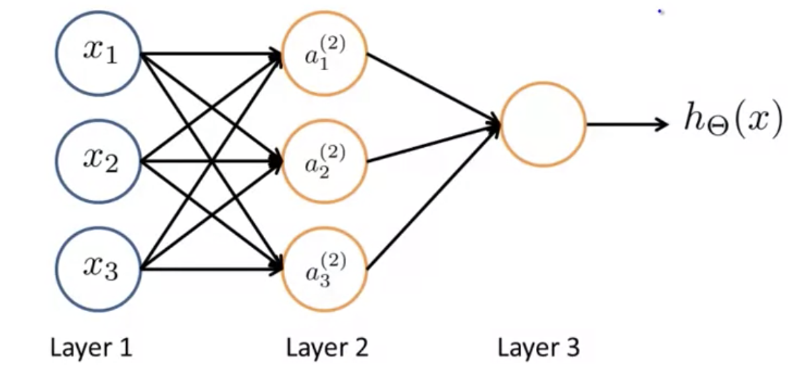
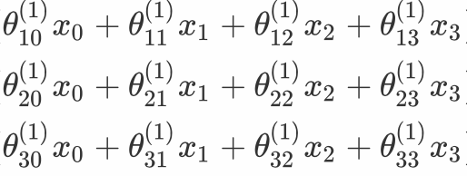
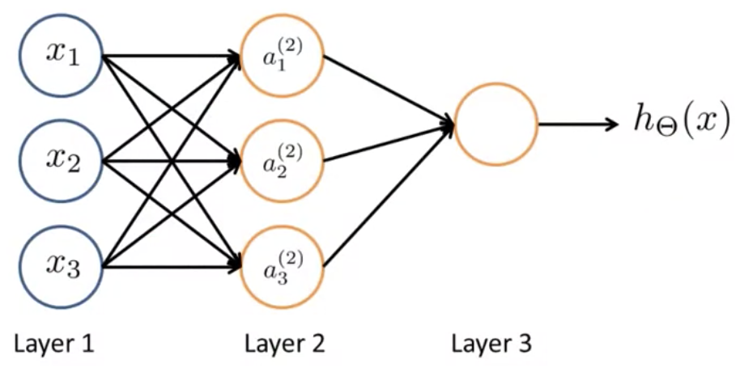
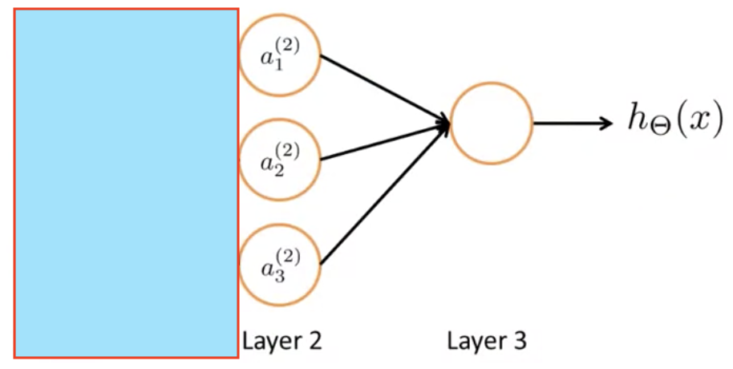
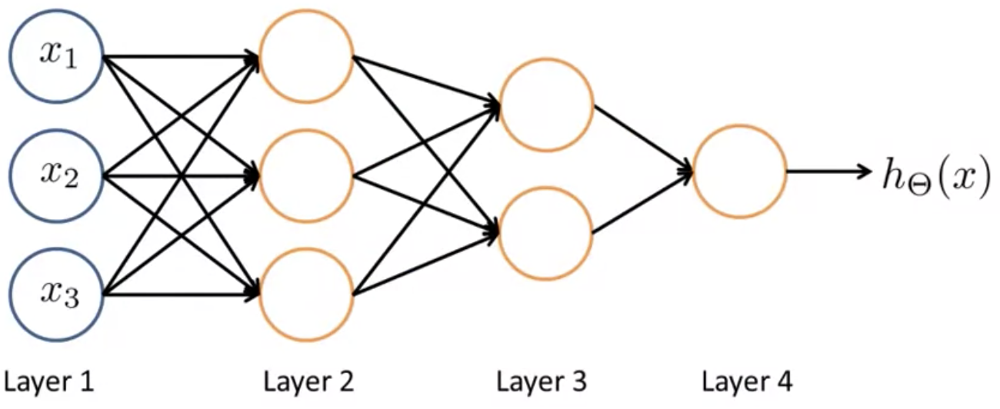

## Neural Networks: Model Representation II [^38]

Now that we've reviewed what the computation is for a neural network, in this section we will discuss how to conduct that computation efficiently and how they can help us solve non-linear propblems.

### Forward Propagation

Consider this neural network:

Previously we said the sequence of steps to compute the activation values fo the 3 hidden units are these equations; and then we use those activation values to compute the final output of the hypothesis $h_{\Theta }(x)$:
$$
a^{(2)}_{1}=g(\Theta^{(1)}_{1,0} x_{0}+\Theta^{(1)}_{1,1} x_{1}+\Theta^{(1)}_{1,2} x_{2}+\Theta^{(1)}_{1,3} x_{3})\\
a^{(2)}_{2}=g(\Theta^{(1)}_{2,0} x_{0}+\Theta^{(1)}_{2,1} x_{1}+\Theta^{(1)}_{2,2} x_{2}+\Theta^{(1)}_{2,3} x_{3})\\
a^{(2)}_{3}=g(\Theta^{(1)}_{30} x_{0}+\Theta^{(1)}_{3,1} x_{1}+\Theta^{(1)}_{3,2} x_{2}+\Theta^{(1)}_{3,3} x_{3})\\
h_{\Theta }(x)=a^{(3)}_1=g\left( c\right)\label{ref1}
$$
The $a_j^{(l)}$ are the values of the $l^{\sf{th}}$ layer neurons.  They are obtained from the $(l-1)^{\sf{th}}$ layer neurons $a_j^{(l-1)}$ using the transformation by the $\Theta^{(l)}$s as shown in that slide, the application of the activation function $g()$ (here sigmoid), and the additional bias node $a_0^{(l)}\equiv 1$.

Defining some additional terms: Let the parameters inside our $g$ function: ($\Theta^{(j-1)}_{1,0} x_{0}+\Theta^{(j-1)}_{1,1} x_{1}+\Theta^{(j-1)}_{1,2} x_{2}+\Theta^{(j-1)}_{1,3} x_{3}$) be defined as: $z^{(j)}_i$.  We can now represent our computation above as follows:
$$
a^{(2)}_{1}=g(z^{(2)}_1)\\
a^{(2)}_{2}=g(z^{(2)}_2)\\
a^{(2)}_{3}=g(z^{(2)}_3)
$$
The superscript $(2)$ indicates that these are values associated with the hidden Layer 2 in the neural network.  The $z$ values are just weighted linear combinations of the input values $x_0, x_1, x_2, x_3$ that go into a particular neuron.

So in other words, for layer $j=2$ and node $k$, the variable $z$ will be:
$$
z^{(2)}_k=\Theta^{(1)}_{k,0}x_0 + \Theta^{(1)}_{k,1}x_1 + ... \Theta^{(1)}_{k,n}x_n
$$
Next, note this combination of numbers from the above calculation:

This set of values corresponds to the matrix vector multiplication of $\Theta^{(1)}$ and the the vector $x$.  With this insight we can vectorize this computation of the neural network.

#### Vectorized Implementation

Given this insight let's define the following, where $x$ is the feature value matrix and $z$ is a 3D vector of z values. 
$$
x=\begin{bmatrix}x_{0}\\ x_{1}\\ x_{2}\\ x_{3}\end{bmatrix} \ \ z^{(2)}=\begin{bmatrix}z^{(2)}_1\\ z^{(2)}_2\\ z^{(2)}_3\end{bmatrix}
$$
Let's vectorize the computation with the following two steps:
$$
z^{(2)}=\Theta^{(1)} \times x
$$
To simplify notation, let’s consider $x$ — the vector of input values — as the activations of Layer 1, or $a^{(1)}$.  Given that we can rewrite this as:
$$
z^{(2)}=\Theta^{(1)} \times a^{(1)}
$$
Then we plug $z^{(2)}$ — a 3D vector — into $g$, the activation applying the sigmoid function elementwise to each of $z$ elements:
$$
a^{(2)}=g(z^{(2)})
$$

With these calculations we have obtained this result $a^{(2)}$, a 3D vector consisting of $\left[ a^{(2)}_1\  a^{(2)}_2\ a^{(2)}_3\right]$.  Remaining, we need to come up with a value for $a^{(2)}_0$.  This corresponds to a bias unit in the hidden layer.  For this we’re goiing to add that with a value of one, turning $a^{(2)}$ into a 4D vector.

Finally to calculate the output value of our hypothesis we need to calculate $z^{(3)}$ which is equal to this term from $(\ref{ref1})$ above:
$$
\Theta^{(2)}_{1,0} a^{(2)}_{0}+\Theta^{(2)}_{1,1} a^{(2)}_{1}+\Theta^{(2)}_{1,2} a^{(2)}_{2}+\Theta^{(2)}_{1,3} a^{(2)}_{3}
$$

This is calculated as follows:
$$
z^{(3)}=\Theta^{(2)} \times a^{(2)}
$$

$$
h_{\Theta }(x)=a^{(3)}=g(z^{(3)})
$$

### Neural Network Learning its own Features

This forward propagation view also helps us to understand what NN might be doing and why they might help us to learn interesting non-linear hypotheses.

Consider this model of a neural network:

If we ignore Layer 1 for illustration:

What we’re left with looks a lot like logistic regression where we’re using the node in Layer 3 (a logistic regression unit) to make a prediction $h_\Theta(x)$.  What the hypothesis is outputting is $g$ (the sigmoid activation function):
$$
h_\Theta(x) = g(\Theta_{0} a_{0}+\Theta_{1} a_{1}+\Theta_{2} a_{2}+\Theta_{3} a_{3})
$$
While this is missing the superscripts $(2)$ as are shown in $(\ref{ref1})$, when written this way it’s evident that this is awfully like the standard logistic regression model. (??)

What the neural network is doing is just like logistic regression except that rather than using the original features $x_1, x_2, x_3$, instead it’s using the activation values from the hidden layer 2: $a^{(2)}_1, a^{(2)}_2, a^{(2)}_3$.

The neat thing about this is that the features from Layer 2 are themselves learned as functions from their input, the function mapping from Layer 1 to Layer 2.

From this very sophisticated neural network architectures can be developed, with multiple layers each feeding its activations as input to the next layer via forward propagation. For example:

From here, we will take these more abstract intuitions and apply them to more concrete examples.