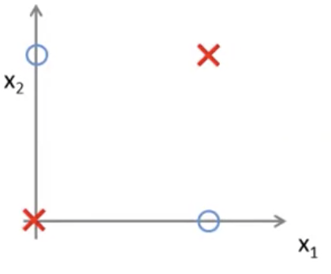
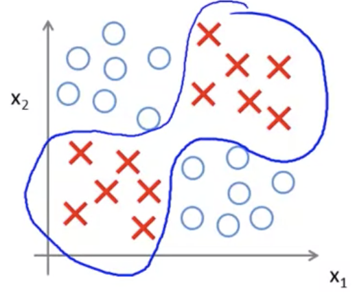
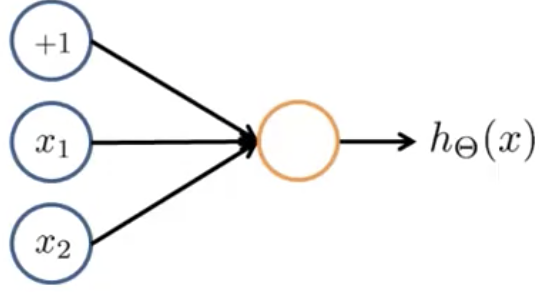
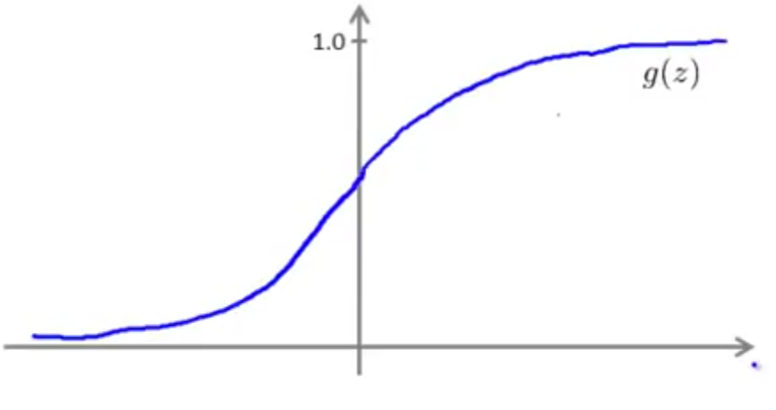

## Examples and Intuitions I

### Non-linear Classification Example: XOR/XNOR

Consider the following classification problem where we have two input features $x$ which can be either $0$ or $1$.  Here’s an illustration showing only 2 positive and two negative examples, showing all possible values.

Here’s a more complex example, showing a non-linear decision boundary that separates the positive from the negative examples:

Concretely, what this is doing is 
$$
y=x_{1}\ XOR\ x_{2}
$$
This means that $y$ will be 1 if both are true or both or false, and $y$ will be 0 if only one of them is either true or false.

#### Simple example: AND

$$
x_1,x_2\in {0,1}\\
y=x_1\ AND\ x_2
$$

As a single unit neural network to compute this function, with an additional +1 unit as a bias unit for $x_0$:

If we assign “weights” for each input — $\Theta_0=-30, \Theta_1=+20, \Theta_2=+20$:
$$
h_\Theta(x)=g(-30+20x_1+20x_2) \label{ref3}
$$
It's helpful to think of these parameters as the edges of the network.

The sigmoid function for this as computed by this single neuron network is:

Given this set of inputs to the hypothesis, this function (see $\ref{ref3}$) will compute a result for the hypothesis function as follows:
$$
\begin{matrix}x_{1}&x_{2}&h_{\Theta }(x)\\ 0&0&g(-30)\approx 0\\ 0&1&g(-10)\approx 0\\ 1&0&g(-10)\approx 0 \\ 1&1&g(10)\approx 1 \end{matrix}
$$
This is the logical AND function (i.e. when $x_1$ and $x_2$ are both 1, the hypothesis returns 1).

Using the same neural network, but assigning different weights:
$$
\Theta_0=-10\\ \Theta_1=+20\\ \Theta_2=+20
$$
We can calculate the logical OR function:
$$
h_\Theta(x)=g(-10+20x_1+20x_2) \label{ref6}
$$
As follows:
$$
\begin{matrix}x_{1}&x_{2}&h_{\Theta }(x)\\ 0&0&g(-10)\approx 0\\ 0&1&g(10)\approx 1\\ 1&0&g(10)\approx 1 \\ 1&1&g(30)\approx 1 \end{matrix}
$$
This illustrates how a single neuron in a network can be used to calculate logical functions.  Next, continuing in following examples we will show how using multiple layers can be used to calculate more complex logical functions such as XOR.
