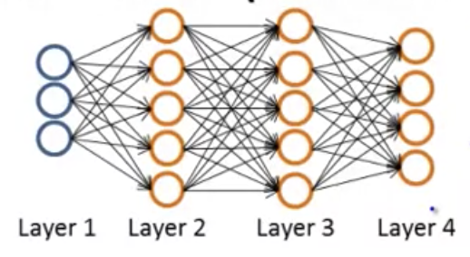

## Cost Function & Backpropagation

Given the following neural network:

And the following training set:
$$
\{(x^{(1)}, y^{(1)}), (x^{(2)}, y^{(2)}),...,(x^{(m)}, y^{(m)})\}
$$
Let's define:

* $L$ = total number of layers in the network.  In this case it’s value is $4$
* $s_l$ = the number of units, not counting the bias unit, in layer $l$.  In this example: $s_1=3$, $s_2=5$, $s_3=5$, and $s_4=s_L=4$
* $K$ = the number of output units or classes. In this case the value is the number of units in Layer 4, or $4$.

For this exercise we’ll consider two types of classification problems: a binary ($y=0\ or\ 1$) and multi-class classification with $K$ classes

In binary classification problems there will be one output unit, or $s_L=1$.  In multi-class problems, there will be $K$ output units.

Recall that in neural networks, we may have many output nodes. We denote $h_\Theta(x)_k$ as being a hypothesis that results in the $k^{th}$ output.

Recall that the cost function for regularized logistic regression was (cf.: [02-simplified-cost-function.md](machine-learning/07-logistic-regression-model/02-simplified-cost-function.md)):
$$
J(\theta )=-\frac{1}{m} \sum^{m}_{i=1} \left[ y^{(i)}\  log(h_{\theta }(x^{(i)}))+(1-y^{(i)})\  log(1-h_{\theta }(x^{(i)}))\right]  +\frac{\lambda }{2m} \sum^{n}_{j=1} \theta^{2}_{j}
$$
Our cost function for neural networks is going to be a generalization of the one we used for logistic regression. This is going to be slightly more complicated:
$$
J(\Theta )=-\frac{1}{m} \sum^{m}_{i=1} \sum^{K}_{k=1} \left[ y^{(i)}_{k}\  log\left( (h_{\Theta }(x^{(i)}))_{k}\right)  +(1-y^{{}(i)}_{k})\  log(1-\left( h_{\Theta }(x^{(i)})\right)_{k}  \right]  +\frac{\lambda }{2m} \sum^{L-1}_{l=1} \sum^{s_l}_{i=1} \sum^{s_l+1}_{j=1} \left( \Theta^{(l)}_{j,i} \right)^{2}
$$
_Note_:

- The double sum simply adds up the logistic regression costs calculated for each cell in the output layer
- The triple sum simply adds up the squares of all the individual $\Theta$s in the entire network.
- The $i$ in the triple sum does **not** refer to training example $i$
