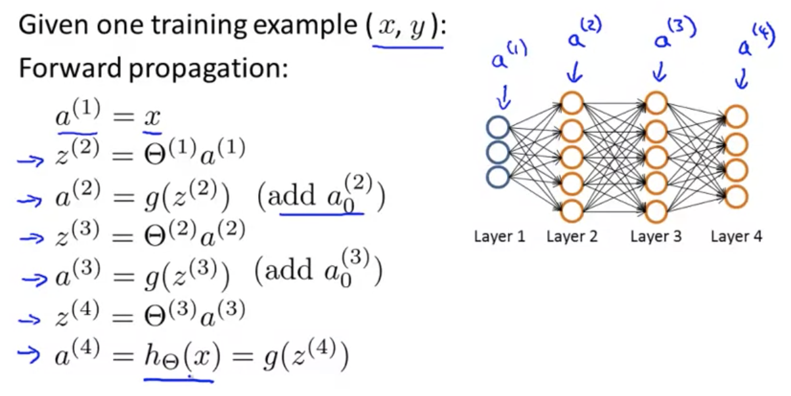

## Backpropagation Algorithm

“Backpropagation” is neural-network terminology for minimizing our cost function, just like what we were doing with gradient descent in logistic and linear regression. Our goal is to find parameters $\Theta$ to try and minimize $J(\Theta)$:
$$
min_\Theta J(\Theta)
$$
That is, we want to minimize our cost function $J$ using an optimal set of parameters in theta. In order to compute this we would need to code the cost function for the set of parameters, $\Theta$ and these partial derivative terms (as [described here](machine-learning/07-logistic-regression-model/03-gradient-descent.md)):
$$
\frac{\partial}{\partial \Theta^{{(l)}}_{i,j}} J(\Theta)
$$

### Gradient Computation

We start with forward propagation to calculate what our hypothesis actually computes, using one training example (x, y):
$$
\begin{align*} 
a^{(1)}&=x \\
z^{(2)}&=\Theta^{(1)}a^{(1)} \\
a^{(2)}&=g(z^{(2)}) \\
z^{(3)}&=\Theta^{(2)}a^{(2)} \\
a^{(3)}&=g(z^{(3)}) \\
z^{(4)}&=\Theta^{(3)}a^{(3)} \\
a^{(4)}&=h_\Theta(x) = g(z^{(4)}) 
\end{align*}
$$

$a$ are the activation values for each layer, and is the result of the calculation of the sigmoid function with the product of the previous activation and parameter. See “[Explanation of Computation in a Neural Network](machine-learning/09-neural-networks-representation/03-neural-networks-model-representation-i.md)” for more background on that.

### Intuition for Backprogation Algorithm

For each node we’re going to calculate the term $\delta^{(l)}_j$ that will somehow represent the “error" of node $j$ in $l$.  Recall that $a^l_j$ is the activation of the $j^{th}$ unit in layer $l$.  This delta term will capture the error of the activation of that node (or, how we might wish that the activation of that node was somehow different).

Using the above neural network as an example where layer L=4, for each output unit we’re going to compute the delta term as the activation of the given unit minus the actual value for that same node in the training set:
$$
\delta^{(4)}_j = a^{(4)}_j - y_j
$$
Because $a^{(L)}_j$ is equal to the hypothesis function $(h_\Theta(x)_j$) the “error” is defined as the difference between the hypothesized value for node 4, $j$ and the actual value for $j$ in the training set. The greater the value for this delta term, the more our hypothesis is incorrect.

We continue backwards from the output layer, computing the delta value for each of the earlier activation layers, as follows:
$$
\begin{align}
\delta^{(3)}_j &= (\Theta^{(3)})^T\delta^{(4)} .* g^\prime(z^{(3)}) \\
\delta^{(2)}_j &= (\Theta^{(2)})^T\delta^{(3)} .* g^\prime(z^{(2)}) \\
\end{align}
$$

* Each delta computation is the result of the theta value for that layer times the delta for the previous layer, times the derivative of the activation function $g$ evaluated at the input values given by $z^{(L)}$ — denoted by $g^\prime$.
* There is no $\delta^{(1)}$, as the first layer corresponds to the input layer, which is just the features we observed in the training set and there is no error associated with that.
* It’s called "back” propagation as we start with the output layer and go backwards through the activation layers to the input layer.

### Back propagation Algorithm

Suppose we have an arbitraily large training set:
$$
\{(x^{(1)}, y^{(1)}), ...,(x^{(m)}, y^{(m)})\}
$$
First we will set the deltas to zero for all $l, i, j$:
$$
\Delta^{(l)}_{ij}=0\ (for\ all\ l, i, j)
$$

* These deltas will act as accumulators, slowly being added to and will be used to calculate the partial derivatives with respect to theta:

$$
\frac{\partial}{\partial\Theta^{(l)}_{(j)}}J(\Theta)
$$

Next we will loop through the training set:

For $i=1$ to $m$:

1. Set $a^{(1)} = x^{(i)}$
2. Perform forward propagation to compute $a^{(l)}$ for $l=2,3,…,L$
3. Using the output label $y^{(i)}$, to compute $\delta^{(L)}=a^{(L)}-y^{(i)}$
4. Compute $\delta^{(L-1)},\delta^{(L-2)},…,\delta^{(2)}$
5. Use the Delta term that we initialized above to accumulate the delta values that we calculated in step #4:  $\Delta^{(l)}_{ij}:=\Delta^{(l)}_{ij}+a^{(l)}_j\delta^{(l+1)}_i$

Then, outside of this above for loop, we will then compute the following:
$$
\begin{align}
D^{(l)}_{ij}&:=\frac{1}{m}\Delta^{(l)}_{ij}+\lambda\Theta^{(l)}_{ij}\ &if\ j\neq 0
\\
D^{(l)}_{ij}&:=\frac{1}{m}\Delta^{(l)}_{ij}\ &if\ j = 0
\end{align}
$$
​    Once we’ve computed these $D$ terms these are exactly the partial derivatives of the cost function which we’re trying to compute; the formal proof for this is quite complicated and beyond the scope of this course:
$$
\frac{\partial}{\partial\Theta^{(l)}_{(j)}}J(\Theta)=D^{(l)}_{ij}
$$
These $D$ terms can then be used in gradient descent algorithms.