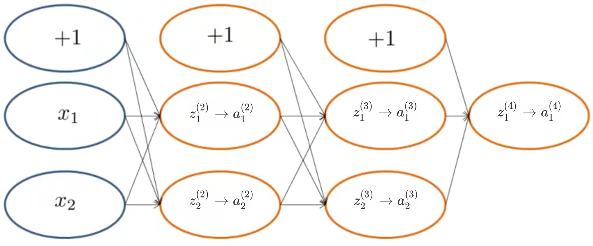

## Backpropagation Intuition

On first impression, this is a really complicated algorithm. It’s a less mathematically simple approach than, say, linear regression.

This lesson is a more mechanical view into backpropagation.

### What is Forward Propagation Doing?

Let’s start by taking a fresh look at what’s happening in Forward Propagation.

Starting with this neural network:

* Given a training set $(x^{(i)}, y^{(i)})$ these are fed into the input layer.
* When we forward propagate to the first hidden layer, what we do is compute $z^{(2)}_1$ and $z^{(2)}_2$ , these are the weighted sum of inputs of the input units.  Then we apply the sigmoid activation function applied to the $z$ values giving us $a^{(2)}_1$ and $a^{(2)}_2$.
* Then we forward propagate again to get the next z and a values, until we reach the output layer.
* As you go from layer to the next, we’re passing weights as $\Theta$ values, summing them into the $z$ value of the next layer.

### What is Back Propagation Doing?

Recall that the cost function for a neural network is:
$$
\begin{gather*}J(\Theta) = - \frac{1}{m} \sum_{t=1}^m\sum_{k=1}^K \left[ y^{(t)}_k \ \log (h_\Theta (x^{(t)}))_k + (1 - y^{(t)}_k)\ \log (1 - h_\Theta(x^{(t)})_k)\right] \\+ \frac{\lambda}{2m}\sum_{l=1}^{L-1} \sum_{i=1}^{s_l} \sum_{j=1}^{s_l+1} ( \Theta_{j,i}^{(l)})^2\end{gather*}
$$
If we consider simple non-multiclass classification ($k = 1$) and disregard regularization, the cost is computed with:
$$
cost(t) =y^{(t)} \ \log (h_\Theta (x^{(t)})) + (1 - y^{(t)})\ \log (1 - h_\Theta(x^{(t)}))
$$
This expression comes directly from within the summation in the above cost function for a neural network, it is the cost for training example $i$: $(x^{(i)}, y^{(i)})$

What this cost function does is play a role similar to the squared error, how close the output the squared difference between the neural network output and the actual value from the training set:
$$
cost(i) \approx (h_\Theta(x^{(i)}))-y^{(i)})^2
$$
While we use the more complicated expression in (1), for the purposes of intuition feel free to think of the cost function as being this squared error cost function  to capture how well the network is doing at predicting $y$.

Let’s look more closely at what BP is doing.  One useful intuition about back propagation is that it’s computing these $$\delta_j^{(l)}$$ as the “error” for the activation value $$a^{(l)}_j$$ (unit j in layer l). 

More formally, the delta values are actually the derivative of the cost function:
$$
\begin{align}
\delta_j^{(l)} &= \dfrac{\partial}{\partial z_j^{(l)}} cost(i) &for\ j \geq 0
\end{align}
$$
Where:
$$
cost(i) = y^{(i)} \ \log (h_\Theta (x^{(i)})) + (1 - y^{(i)})\ \log h_\Theta(x^{(i)})
$$
These provide a measure of how much we would want to change the weights of the intermediate values of the computation (the $z$ values). Recall that our derivative is the slope of a line tangent to the cost function, so the steeper the slope the more incorrect we are.

Let us consider the following neural network below and see how we could calculate some $$\delta_j^{(l)}$$:

xxx

In the image above, to calculate $$\delta_2^{(2)}$$, we multiply the weights $$\Theta_{12}^{(2)}$$ and $$\Theta_{22}^{(2)}$$ by their respective $$\delta$$ values found to the right of each edge. So we get 
$$
\delta_2^{(2)}=\Theta_{12}^{(2)}*\delta_1^{(3)}+\Theta_{22}^{(2)}*\delta_2^{(3)}
$$
To calculate every single possible $$\delta_j^{(l)}$$, we could start from the right of our diagram.

We can thing of our edges as our $$\Theta_{ij}$$. Going from right to left, to calculate the value of $$\delta_j^{(l)}$$, you can just take the overall sum of each weight times the $$\delta$$ it is coming from.

Hence, another example would be:
$$
\delta_2^{(3)}=\Theta_{12}^{(3)}*\delta_1^{(4)}
$$
