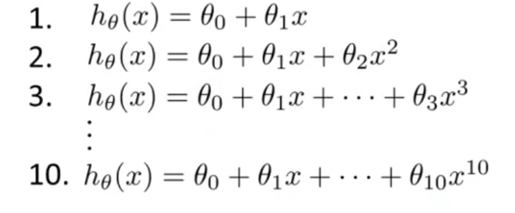

## Model Selection [^51]

Suppose you'd like to decide what degree of polynomial to use to fit a data set, or what features to use, or you'd like to choose the regularlization parameter lambda for a learning algorithm?

These are all questions of _model selection_.

### The Problem of Overfitting

Just because a learning algorithm fits a training set well, that does not mean it is a good hypothesis. It could over fit and as a result your predictions may not scale to new examples.  In other words, the fact that your hypothesis does well on a training set doesn't mean much in terms of predicting how well your hypothesis will generalize to other examples not found in the training set.  More generally, once a parameter is fit to some set of data, maybe a training set or maybe someother data set, then the error of the hypothesis as measured _on that same data set_ is unlikely to be a good estimate of your actual generalization error: i.e. how well the hypothesis will generalize to new examples.

### Model Selection

Let's say you're trying to choose the degree of polynomial to use ("$d$"), to fit your training set:

And, we want to choose one of these models and understand how well they will fit to new examples. We could apply each model to a given training set, minimize training error, resulting in a parameter vector $\Theta^{(1,2,…10)}$ for each.  Then we can take each set of parameters and look at test set error for each $J_{test}(\Theta^{(1,2,…10)})$, taking each hypotheses with corresponding parameters and measure the performance on the test set.  

In order to select one of these models, we could see which has the lowest test set error, say $d=5$.  But let's say we want to ask, "how well does this model generalize?" — one thing we could do is to look at how well the $5^{th}$ order polynomial hypothesis did on our test set; however, this is not a fair estimate of how our hypthesis will generalize: $J_{test}(\Theta^{(5)})$ is likely to be an optimistic estimate of generalization error.  This is because we have fit these parameters to the test set already, so they're likely to do well on our training set even if they don't do well on other examples.

#### Generalizing the Model Selection

In order to address this problem, if we want to validate an hypothesis we would split the training set into three sets (instead of two):

* Training set: 60%
* Test set: 20%
* Cross validation set: 20%

We can now calculate three separate error values for the three different sets using the following method:

1. Training Error
   $$
   J(\Theta) = J_{train}(\Theta) = \frac{1}{2m}\sum^m_{i=1}(h_{\Theta}(x^{(i)})-y^{(i)})^2
   $$

2. Validation Error
   $$
   J_{cv}(\Theta) = \frac{1}{2m_{cv}}\sum^m_{i=1}(h_{\Theta}(x_{cv}^{(i)})-y^{(i)}_{cv})^2
   $$

3. Test Error

$$
J_{test}(\Theta) = \frac{1}{2m_{test}}\sum^m_{i=1}(h_{\Theta}(x_{test}^{(i)})-y^{(i)}_{test})^2
$$

So, instead of using the test set to select the model, we will use the validation set to choose it. From there, we will choose which hypothesis performs best on the validation set.  Then we use the test set to measure/estimate the generalization error of that hypothesis.

In summary:

1. Optimize the parameters in $\Theta$ using the training set for each polynomial degree;
2. Find the polynomial degree $d$ with the least error using the cross validation set;
3. Estimate the generalization error using the test set with $J_{test}(\Theta^{(d)})$, ($d$ = theta from polynomial with lower error).

This way, the degree of the polynomial $d$ has not been trained using the test set.
