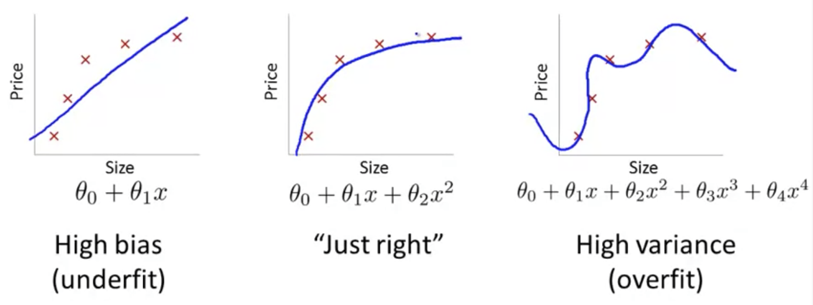

## Diagnosing Bias vs. Variance [^52]

In this section we examine the relationship between the degree of the polynomial $d$ and the underfitting or overfitting of our hypothesis.

* We need to distinguish whether **bias** or **variance** is the problem contributing to bad predictions.
* High bias is underfitting and high variance is overfitting. Ideally, we need to find a golden mean between these two.

The training error will tend to **decrease** as we increase the degree $d$ of the polynomial.

At the same time, the cross validation error will tend to **decrease** as we increase $d$ up to a point, and then it will **increase** as $d$ is increased, forming a convex curve.

**High bias (underfitting)**: both $J_{train}(\Theta)$ and $J_{CV}(\Theta)$ will be high. Also, $J_{CV}(\Theta) \approx J_{train}(\Theta)$.

**High variance (overfitting)**: $J_{train}(\Theta)$ will be low and $J_{CV}(\Theta)$ will be much greater than $J_{train}(\Theta)$.

This summarized in the figure below:

