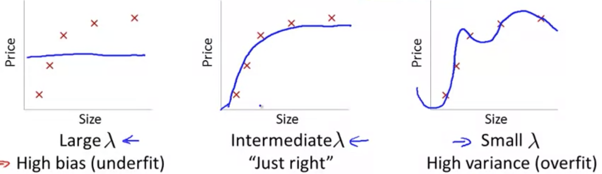
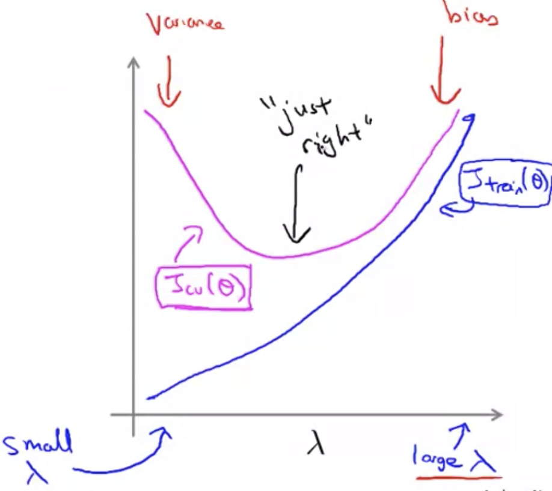

## Regularization and Bias/Variance [^53]

Suppose we're fitting a higher-order polynomial such as:

$$
h_\theta(x)=\theta_0+\theta_1x+\theta_2x^2+\theta_3x^3+\theta_4x^4
$$

And, to prevent overfitting we're using a regularization term in the cost function to keep the values of the parameters small:

$$
J(\theta)=\frac{1}{2m}\sum^m_{i=1}(h_\theta(x^{(i)})-y^{(i)})^2+\frac{\lambda }{2m} \sum^{n}_{j=1} \Theta^{2}_{j}
$$

The regularization term is: $\frac{\lambda }{2m} \sum^{n}_{j=1} \Theta^{2}_{j}$.

Let's consider three cases related to the value of $\lambda$ in the regularization term, and it's effect on the cost:

As above, we see that as $\lambda$ increases to some large value (e.g. 10,000), our fit becomes more rigid; conversely, as $\lambda$ approaches zero we tend to overfit the data.

### Choosing the Optimal Value for Lambda

In order to choose the model and the regularization term $\lambda$, we need to:

1. Create a list of lambdas, say by stepping up by 2x:
   $$
   \lambda \in \{0,0.01,0.02,0.04,0.08,0.16,0.32,0.64,1.28,2.56,5.12,10.24\}
   $$

2. Create a set of models with different degrees or any other variants.

3. Iterate through the $\lambda$s and for each $\lambda$ go through all the models to learn some $\Theta$.

4. Compute the cross validation error using the learned $\Theta$ (computed with $\lambda$) on the $J_{CV}(\Theta)$ **without** regularization or with $\lambda=0$.

5. Select the best combo that produces the lowest error on the cross validation set.

6. Using the best combination of $\Theta$ and $\lambda$, apply it on $J_{test}(\Theta)$ to see if it has a good generalization of the problem.

### Bias/Variance as a Function of Lambda

How well does my hypothesis do on the training set and the CV set as we vary the regularization parameter.

* $J_{train}(\theta)$

  For small values of lambda you can fit relatively well, the regularization term goes away.  Whereas for a larger value of lambda $J_{train}$ will get large.

* $J_{cv}(\theta)$

  For small values of lambda you end up underfitting & $J_{cv}$ will be high.  For higher values bias will increase.

