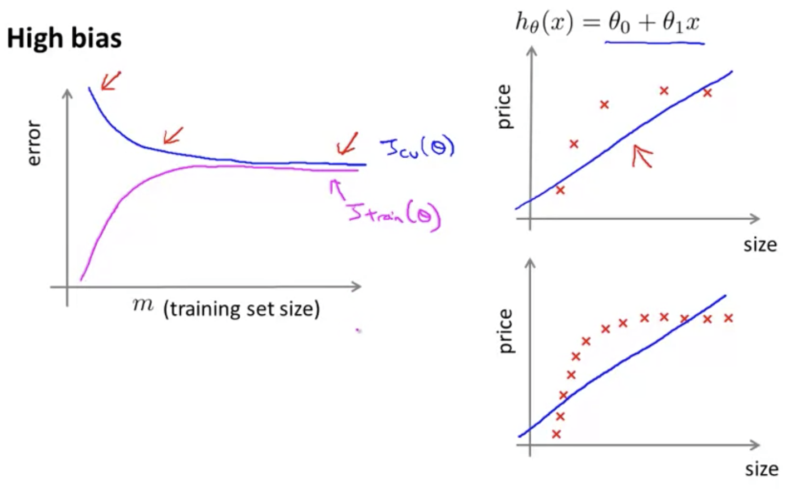
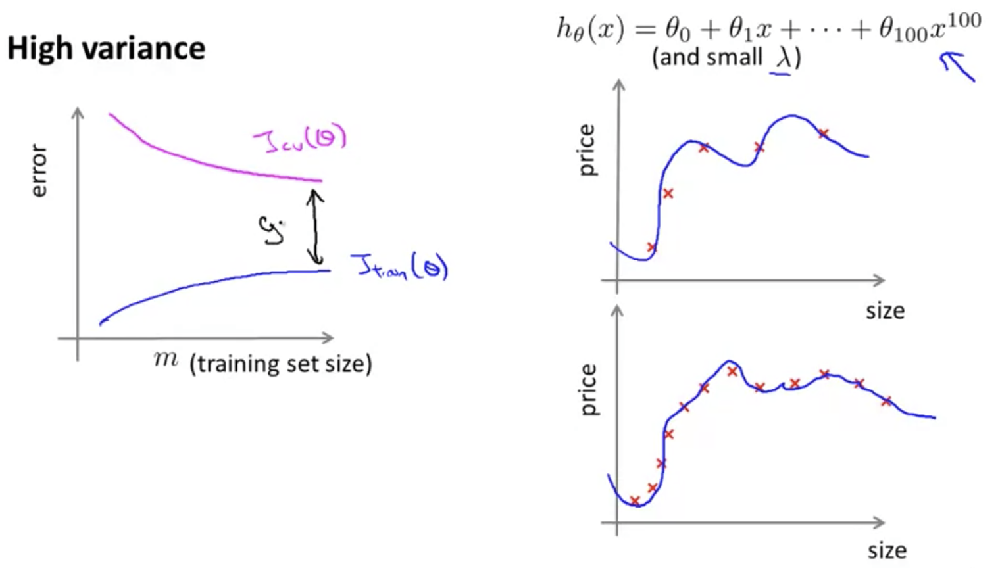

## Learning Curves

Often a useful thing to plot: to sanity check the algorithm or to improve its performance.  Often used to try to diagnose if a learning algorithm has bias, or a variance problem, or both.

A learning curve is a plot of error ($J_{train}$ and $J_{cv}$) by training set size $m$

Training an algorithm on a very few number of data points (such as 1, 2 or 3) will easily have 0 errors because we can always find a quadratic curve that touches exactly those number of points. Hence:

* If the training set is small, then the training error is going to be small.
* As the training set gets larger, the error for a quadratic function increases.
* The error value will plateau out after a certain $m$, or training set size.
* If the cross validation dataset is small, then the CV error is going to be large, and will decrease as the CV dataset increases.

### Experiencing high bias

**Low training set size** — causes $J_{train}(\Theta)$ to be low and $J_{CV}(\Theta)$ to be high.

**Large training set size** — causes both $J_{train}(\Theta)$ and $J_{CV}(\Theta)$ to be high with $J_{train}(\Theta) \approx J_{CV}(\Theta)$

If a learning algorithm is suffering from **high bias**, getting more training data will not **(by itself)** help much.

### Experiencing high variance

**Low training set size** — $J_{train}(\Theta)$ will be low and $J_{CV}(\Theta)$ will be high.

**Large training set size** — $J_{train}(\Theta)$ increases with training set size and $J_{CV}(\Theta)$ continues to decrease without leveling off. Also, $J_{train}(\Theta) < J_{CV}(\Theta)$ but the difference between them remains significant.

If a learning algorithm is suffering from **high variance**, getting more training data is likely to help.  As more data is added both $J_{train}$ and $J_{cv}$ will improve and approach convergence.

