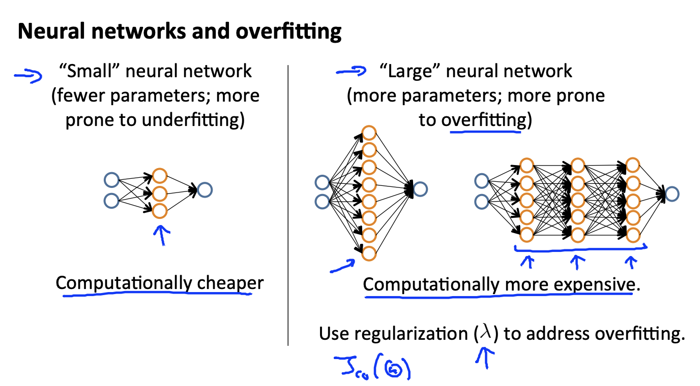

## Deciding on What to Try Next: Revisited [^55]

 

Our decision process can be broken down as follows:

* **Getting more training examples:** Fixes high variance

* **Trying smaller sets of features:** Fixes high variance

* **Adding features:** Fixes high bias

* **Adding polynomial features:** Fixes high bias

* **Decreasing λ:** Fixes high bias

* **Increasing λ:** Fixes high variance.

```
+------------------------------+-----------------------------------+
| High Bias                    | High Variance                     |
+==============================+===================================+
| * Adding features            | * Getting more training examples  |
| * Adding polynomial features | * Trying smaller sets of features |
| * Decreasing λ               | * Increasing λ (regularization)   |
+------------------------------+-----------------------------------+
```

### Diagnosing Neural Networks



* A neural network with fewer parameters is **prone to underfitting**. It is also **computationally cheaper**.
* A large neural network with more parameters is **prone to overfitting**. It is also **computationally expensive**. In this case you can use regularization (increase λ) to address the overfitting.

Using a single hidden layer is a good starting default. You can train your neural network on a number of hidden layers using your cross validation set. You can then select the one that performs best.  

That said, using a larger neural network often is more effective with regularization to address overfitting than using a smaller network with the main disadvantage being it's computationally expensive.

#### Model Complexity Effects

* Lower-order polynomials (low model complexity) have high bias and low variance. In this case, the model fits poorly consistently.
* Higher-order polynomials (high model complexity) fit the training data extremely well and the test data extremely poorly. These have low bias on the training data, but very high variance.
* In reality, we would want to choose a model somewhere in between, that can generalize well but also fits the data reasonably well.
