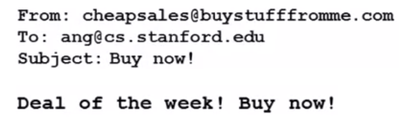

## Prioritizing What to Work On [^56]

In order to illustrate how to organize the work that needs to be done, let's look at what's involved in building a spam classifier for email.

Given a labeled training set of spam & not-spam emails, how do we build a classifier using supervised learning to distinguish new emails?

The first decision we must make is how do we want to represent the features $x$ of the email? One way would be to choose 100 words that if they're present would indicate that the email might be spam.  For example:

> deal, buy, discount, Andrew, now, ….

Given an email that we'd like to see whether is spam or not:

We can then encode it into a feature vector by seeing whether or not those words appear in the email:
$$
x = \begin{bmatrix}0\\ 1\\ 1\\ 0\\ \vdots \\ 1\\ \vdots \\ \end{bmatrix} \begin{matrix}andrew\\ buy\\ deal\\ discount\\ \vdots \\ now\\ \vdots \end{matrix}
$$
The feature vector would be as long as the number of words we chose for this representation.  And, each feature $x_j$ would be 1 if word $j$ appears in the email, and 0 if not.

In practice, we would take the most frequently occurring $n$ words (10,000 - 50,000) in the training set, rather than manually picking 100 words.

So, when building such a classifier, how could we spend our time in order to make it have low error?

* Collect lots of data (e.g. "honeypot" project)

* Develop more sophisticated features based on email routing information in the email header (e.g. spammers may craft fake headers to escape detection)

* Develop more sophisticated features for message body. (e.g. "discount" vs "discounts" , "dealer" vs "deal", message punctuation)

* Detect misspellings (e.g. "d1sc0unts")

Each of these can be valid approaches, but it's not clear upfront which may be more valuable than another.  In order to assist in choosing approaches, next we will look at a strategy for evaluating different strategies known as "Error Analysis."
