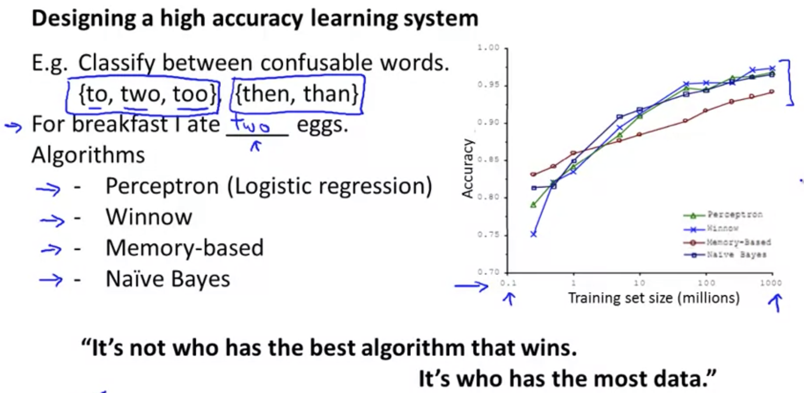

## Using Large Data Sets [^60]

How much data should we train on?

Under certain conditions getting a lot of data and training on a certain kind of learning algorithm could be a very good way to get a very high performance algorithm.

In this example where 4 different algorithms for classification of confusable words are being compared you can see that they all improve when given larger datasets; indeed, in some cases inferior algorithms on smaller datasets improve so dramatically with larger datasets that they can become the superior algorithm to use.

This is so because the feature $x$ has sufficient information to predict $y$ accurately.  In the confusable words example above, the features capture the words "for breakfast I ate _xxx_ eggs", and that is sufficient for the algorithm to predict the word "two" for _xxx_.

However, let's say we're trying to predict housing price from only the size in square feet and no other features.  Well there are so many other factors that impact the price that you wouldn't people to predict it very accurately.

Given the same inputs, can a human expert confidently predict $y$?