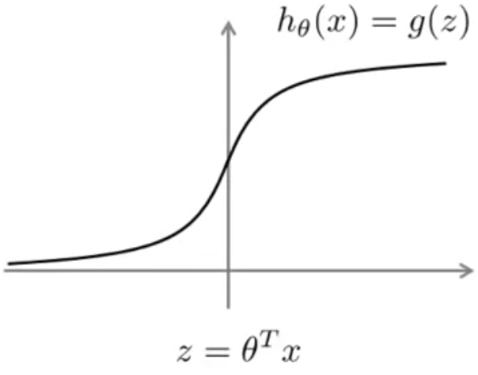
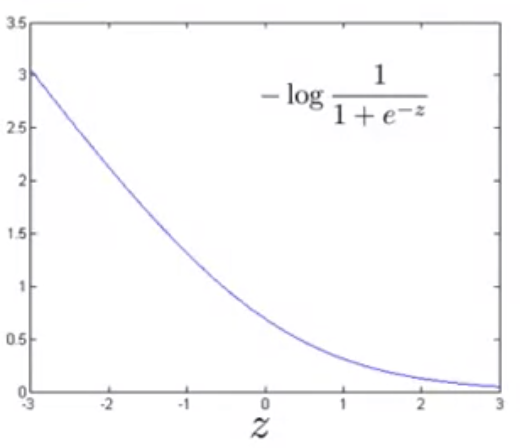
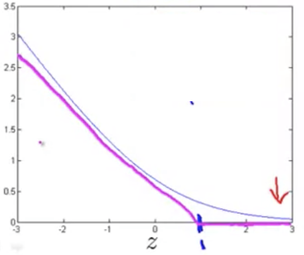
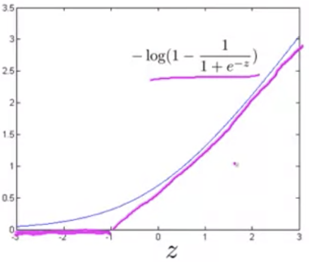

## Large Margin Classification

### Optimization Objective

In order to describe the SVM algorithm let's review first logistic regression. Through a few straightforward modifications to logistic regression, we can arrive at the approach for support vector machines.

First, our hypothesis function for logistic regression:
$$
h_\theta(x)=\frac{1}{1+e^{-\theta^Tx}}
$$
The sigmoid activation function as plotted:

Drawing from that plot above, we can say the following:

* If $y=1$, we want $h_\theta(x)\approx1$, and $\theta^Tx\gg0$
  * If $y$ is equal to one, then we're hoping that our hypothesis will be close to one, and theta transpose x will be much greater than 0.
* If $y=0$, we want $h_\theta(x)\approx0$, and $\theta^Tx\ll0$
  * Conversely, If $y$ is equal to zero, then we're hoping that our hypothesis will be close to zero, and theta transpose x will be much less than 0.

Looking at the [cost function for logistic regression](machine-learning/07-logistic-regression-model/02-simplified-cost-function.md):
$$
-y\ log(h_\theta(x))-(1-y)log(1-h_\theta(x))
$$
If we then substitute in the value of $h_\theta(x)$ from formula (1) above:
$$
-y\ log(\frac{1}{1+e^{-\theta^Tx}})-(1-y)log(1-\frac{1}{1+e^{-\theta^Tx}})
$$
And, we know that if $y=1$, then the second term will go to zero and we'll be left with the formula $-log(\frac{1}{1+e^{-\theta^Tx}})$, plotted as so (letting $z$ be equal to $\theta^Tx$):

As you can see from the graph of the cost formula for $y=1$ plotted as a function of $z$, that for very large values of $z$ the cost goes to zero, a very small contribution to the cost function (when logistic regression sees a positive example, with $y=1$, it tries to set $\theta^Tx$ to a very large value).

Intuitively, to build a support vector machine we take this cost function and modify it a little bit as follows.  When $y=1$:

This curve in magenta is a pretty close approximation to the logistic regression cost function curve, but with two straight line segments: a flat portion, and a sloping line with a vertex at $y=1$.

When $y=0$, we have a similar approximation of the logistic regression cost function curve, except that we'll be approximating the curve as plotted from $-log(1-\frac{1}{1+e^{-z}})$:

And again, as above for $y=1$, the approximation consists of two straight line segments.

These two approximated curves can be named as follows: when $y=1$, $cost_1(z)$, and when $y=0$, $cost_0(z)$

Building on the [regularized cost function for logistic regression](machine-learning/08-regularization/04-regularized-logistic-regression.md): 
$$
\min_\theta\frac{1}{m} \left[\sum^{m}_{i=1} y^{(i)} (-log\ h_{\theta }(x^{(i)}))+(1-y^{(i)}) \left((-log(1-h_{\theta }(x^{(i)}))\right) \right]+\frac{\lambda}{2m}\sum^n_{j=1}\theta^2_j
$$
And substituting the $cost_y(z)$ functions from above:
$$
\min_\theta\frac{1}{m} \sum^{m}_{i=1} y^{(i)} cost_1(z) + (1-y^{(i)}) \ cost_0(z)+\frac{\lambda}{2m}\sum^n_{j=1}\theta^2_j
$$
Further reducing leaves us:
$$
\min_\theta \sum^{m}_{i=1} y^{(i)} cost_1(z) + (1-y^{(i)}) \ cost_0(z)+\frac{\lambda}{2}\sum^n_{j=1}\theta^2_j
$$
And then, with Support Vector Machines, the convention is to invert $\lambda$ in a value known as $C$:
$$
\min_{\theta } C\sum^{m}_{{}i=1} \left[ y^{(i)}cost_{1}(\theta^{T} x^{(i)})+\left( 1-y^{(i)}\right)  cost_{0}(\theta^{T} x^{(i)})\right]  +\frac{1}{2} \sum^{n}_{i=1} \theta^{2}_{j}
$$

### SVM Hypothesis

The hypothesis for SVM will output 1 if $\theta^Tx\ge0$ and 0 otherwise.
