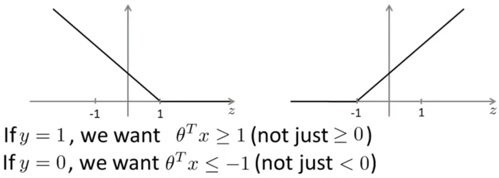
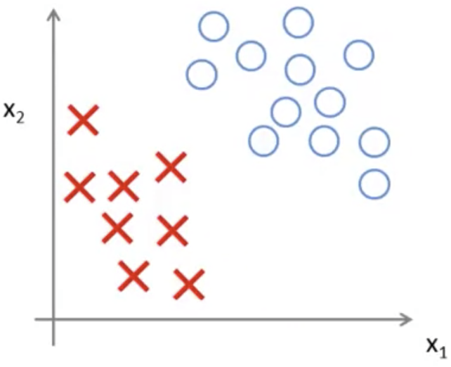
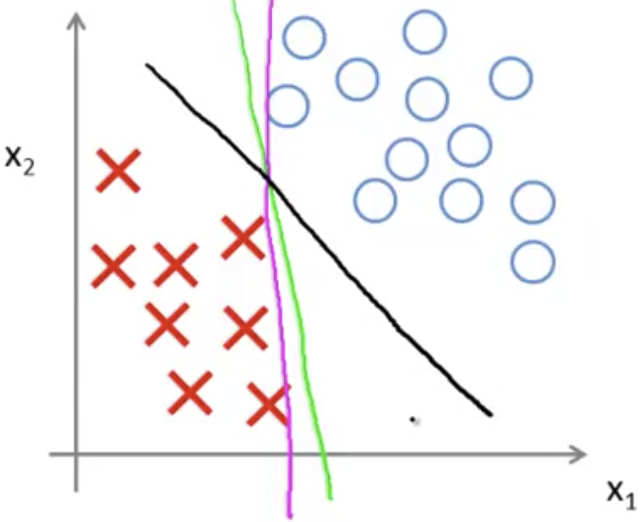

### Large Margin Intuition [^62]

Sometimes people refer to SVMs as "Large Margin Classifiers."  By showing us what this means, we can also get a better picture of what an SVM hypothesis may look like.

Given the cost function for a support vector machine, and how it looks when plotted when $y={0,1}$:
$$
\min_{\theta } C\sum^{m}_{{}i=1} \left[ y^{(i)}cost_{1}(\theta^{T} x^{(i)})+\left( 1-y^{(i)}\right)  cost_{0}(\theta^{T} x^{(i)})\right]  +\frac{1}{2} \sum^{n}_{i=1} \theta^{2}_{j}
$$

Given the goal of minimizing the cost (error) of a given set of parameters.  As we see above, when $y=1$, the cost is minimized only when $z$ (which is shorthand for the product of the transposed vector of parameters and $x$: $\theta^Tx$) is greater than or equal to 1.  And, conversely, if $y=0$ then $\theta^Tx \le -1$.

Now, from the plots above one can see that $z$ can actually be greater than or equal to zero and will round up to 1, but a property of SVMs is to have a built-in margin to correct for errors.

#### SVM Decision Boundary

Referring back to our cost function for SVM, if $C$ is a very large value, then when minimizing the optimization objective ($y^{(i)}cost_{1}(\theta^{T} x^{(i)})+\left( 1-y^{(i)}\right)  cost_{0}(\theta^{T} x^{(i)})$) we will be highly motivated to choose values for $\theta$ so that it is close to zero.

Given that, then our cost function becomes:
$$
\min_{\theta } C \times 0 +\frac{1}{2} \sum^{n}_{i=1} \theta^{2}_{j} \\
\downarrow \\
\min_{\theta } \frac{1}{2} \sum^{n}_{i=1} \theta^{2}_{j}
$$
subject to the constraints:

* $\theta^Tx \ge 1$ if $y^{(i)}=1$, and
* $\theta^Tx \le -1$ if $y^{(i)}=0$

It turns out when you solve this optimization problem, when you minimize this as a function of the parameters $\theta$, it ends up with a very interesting decision boundary: where the data is "linearly separable."

##### Linearly Separable Data

Take this example of a dataset with positive and negative examples:

This data is _linearly separable_, meaning that there exists many different lines that can separate the positive and negative examples perfectly.  For example, here are three lines that each separate the examples:

Now the green & magenta cases don't appear to be particularly good choices.  The support vector machine will choose a boundary as the one in black, which does a better job of separating the examples.  Mathematically it has a larger minimum distance ("margin") from the training examples, whereas the green and magenta lines come very close to the examples which seems to do a less good job separating the examples.  For this reason, a SVM is also known as a "large margin classifier," and also due to this margin it gives the SVM a certain robustness because it tries to separate this hypothesis with as large a margin as possible.

In the next section we'll explain why we end up with a large margin in this way.

##### Large Margin Classifier in Presence of Outliers

The above is an example when C is very large (~100000).  When used in this way, the data is very sensitive to outliers. In practice, the value of C will not be so large and will do the right thing.  
