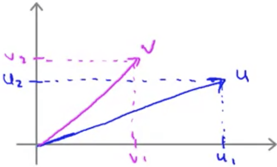
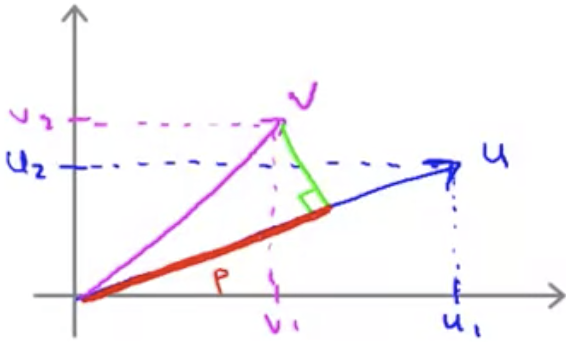

### Mathematics Behind Large Margin Classification

#### Background: Vector Inner Product

Given two vectors $u$ and $v$, what is $u^Tv$, also known as the _inner product_ between these two vectors.

As these are 2d vectors they can be plotted like this:

A useful quantity from this is the "norm" or _euclidean length_ of the vector:
$$
\left\Vert u\right\Vert  =\sqrt{u^{2}_{1}+u^{2}_{2}} \in \mathbb{R}
$$
One way to calculate the inner product is to take the length of the projection ("$p$") of $v$ onto $u$ (seen as the red line in this graph:

So that we can obtain the inner product:
$$
u^Tv=p \times \left\Vert u\right\Vert
$$
And, this will give us the same result as:
$$
u_1v_1+u_2v_2
$$
We're going to use these properties to understand the optimization objective of Support Vector Machines.

#### Support Vector Machine Decision Boundary

Given the optimization objective for Support Vector Machines:
$$
\min_{\theta } \frac{1}{2} \sum^{n}_{i=1} \theta^{2}_{j}
$$
It's shown in the video that this is equivalent to:
$$
\frac{1}{2}\left\Vert \theta\right\Vert^2
$$
So, what this is showing us is that it's minimizing the squared norm of the squared length of the parameter vector $\theta$.

Next let's look at $\theta^Tx^{(i)}$

Earlier we saw that $u^Tv$ is equal to $p\times\left\Vert u\right\Vert$

So derived from this we can now see the optimization objectives for SVM as:
$$
\min_{\theta } \frac{1}{2}\left\Vert \theta\right\Vert^2 \\
\begin{align*} 
s.t. \\
&p^{(i)}\times\left\Vert\theta\right\Vert \ge 1\ &if\ y^{(i)}=1
\\
&p^{(i)}\times\left\Vert\theta\right\Vert \le -1 \ &if\ y^{(i)}=0
\end{align*}
$$
$p^{(i)}$, which is the projection of $x^{(i)}$ onto $\theta$, corresponds to the margin of the hypothesis, and if that is large that will be consistent with the need to minimize $\left\Vert \theta\right\Vert$.
