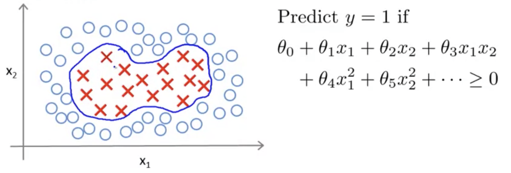

## Kernels - I

Adapting support vector machines in order to develop complex nonlinear classifiers.

### Non-linear Decision Boundary

When we're faced with a boundary that's non-linear in this way, in order to model this boundary to distinguish positive & negative values, one way to do so is to find a complex set of polynomial features (e.g. $\theta_4x^2_1$).

Another way to consider this, introducing some new notation is to use $f_1, f_2, f_3$ etc. to represent these different polynomial features.
$$
\theta_0 + \theta_1f_1+ \theta_2f_2+ \theta_3f_3+ ...
$$
So, our question is whether there a different/better choice of the features $f_1, f_2, f_3$?

### Kernel

Given $x$, compute a new feature depending on proximity to landmarks $l^{(1)}, l^{(2)}, l^{(3)}$:
$$
f1 = similiarity(x,l^{(1)}) = exp\left( - \frac{\left\Vert x-l(1)\right\Vert ^2}{2\sigma^2} \right) \\
f2 = similiarity(x,l^{(2)}) = exp\left( - \frac{\left\Vert x-l(2)\right\Vert ^2}{2\sigma^2} \right) \\
f3 = similiarity(x,l^{(3)}) = exp\left( - \frac{\left\Vert x-l(3)\right\Vert ^2}{2\sigma^2} \right)
$$
The similarity function is known as a "kernel function", and this specific one is known as a Gaussian kernel.  This represents the component wise distance between vector $x$ and vector $l$.  Sometimes also written as $k(x, l^{(i)})$

What do these "Kernels" do, and why do these similarity functions make sense?

Supposing $x$ is close to a feature $l^{(1)}$, then the formula in the numerator will be close to zero, therefore $f_1$ will be close to 1:
$$
f1 \approx exp\left(-\frac{0^2}{2\sigma^2}\right)\approx 1
$$
Alternatively, suppose x is far from $l^{(1)}$, then the numerator will be a very large number, and $f_1$ wil be close to 0:
$$
f1 \approx exp\left(-\frac{(large\ number)^2}{2\sigma^2}\right)\approx 0
$$
What these features indicate is how similar $x$ to the landmarks.  When it's zero it's far from the landmark, and when it's 1 it's close to the landmark.  Each landmark defines a new feature.

This is how via the definition of landmarks and the kernel function we can learn pretty complex non-linear decision boundaries where we predict positive values for $y$ when $x$ is close to a landmark and zero when we're far away.  This is part of the idea of kernels and how we use them with support vector machines by defining these extra features using landmarks and similarity functions.
