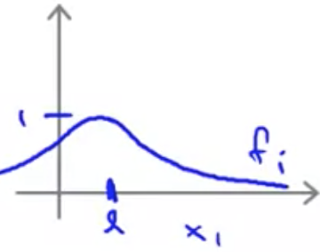
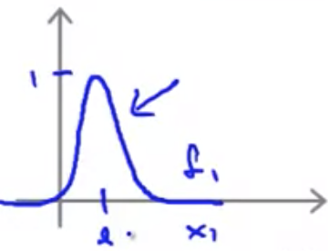

## Kernels - II

How do we get the landmarks that we use and how should we integrate them into a support vector machine?

#### Choosing Landmarks

For every example in the training set we use that value as a landmark.  By doing so, the features are going to measure how close an example is to one of the things we saw in the training set.

Given a training set $(x^{(1)}, y^{(1)}), (x^{(2)}, y^{(2)}), …, (x^{(m)}, y^{(m)})$, choose $l^{(1)}=x^{(1)}, l^{(2)}=x^{(2)}, …, l^{(m)}=x^{(m)}$.

So, given example $x$:
$$
f_1 = similarity (x,l^{(1)}) \\
f_2 = similarity (x,l^{(2)}) \\
\vdots \\
f_m = similarity (x,l^{(m)}) \\
$$
From this we get a feature vector $f$:
$$
f = \begin{bmatrix}f_{0}\\ f_{1}\\ f_{2}\\ \vdots \\ f_{m}\end{bmatrix}
$$

So, given a training example $(x^{(i)}, y^{(i)})$, we can calculate each feature using the landmark by passing them to the similarity function:
$$
f^{(i)}_1=similarity(x^{(i)}, l^{(1)}) \\
f^{(i)}_2=similarity(x^{(i)}, l^{(2)}) \\
\vdots \\
f^{(i)}_m=similarity(x^{(i)}, l^{(m)}) \\
$$
Among all of these features, one of the training examples will equal the landmark and result in a value of 1 for the feature. This feature will be very close to the training example:
$$
f^{(i)}_i=similarity\left(x^{(i)}_i,l^{(i)}_i\right)=exp\left(-\frac{0}{2\sigma^2}\right)=1
$$
We can now represent our training example with this training vector, using all of the features deduced from the use of the similarity function:
$$
f^{(i)} = \begin{bmatrix}f^{(i)}_{0}\\ f^{(i)}_{1}\\ f^{(i)}_{2}\\ \vdots \\ f^{(i)}_{m}\end{bmatrix}
$$

#### Support vector machines with Kernels

This vector of features then gets substituted into the process for minimizing the cost function in the place of the training examples in order to learn the optimal set of parameters:
$$
\min_{\theta } C\sum^{m}_{{}i=1} \left[ y^{(i)}cost_{1}(\theta^{T} x^{(i)})+\left( 1-y^{(i)}\right)  cost_{0}(\theta^{T} x^{(i)})\right]  +\frac{1}{2} \sum^{n}_{i=1} \theta^{2}_{j} \\
\downarrow \\
\min_{\theta } C\sum^{m}_{{}i=1} \left[ y^{(i)}cost_{1}(\theta^{T} f^{(i)})+\left( 1-y^{(i)}\right)  cost_{0}(\theta^{T} f^{(i)})\right]  +\frac{1}{2} \sum^{m}_{j=1} \theta^{2}_{j}
$$
This would give us the learned set of parameters $\theta$, and then given a value of $x$ and we'd like to make a prediction, we compute the features $f$ and can predict $y=1$ if $\theta^Tf\ge0$

#### Tradeoffs with SVM parameters

When applying a SVM how do you choose the parameters?  Bias and variance tradeoffs when using an SVM.

When using a SVM, you have to choose the parameter $C$. 

* When you have a large value of $C$: hypothesis have lower bias, higher variance. 
* When you have a small value of $C$: hypothesis have higher bias, lower variance. 

You also choose the parameter $\sigma^2$.

* When you have a large $\sigma^2$ then features $f_i$ varies more smoothly: higher bias, lower variance.  The gaussian kernel will fall off more gently.

  

* If $\sigma^2$ is small, then the features will vary more abruptly. Lower bias, and higher variance.

  
