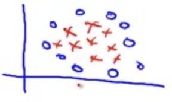

## Using a Support Vector Machine [^66]

It is not recommended to use your own code to solve for the parameters $\theta$, rather you should use a library as this software is very complex.

That said there are still decisions that you will need to do:

* Choice of parameter $C$
* Choice of kernel (similarity function)

### Logistic Regression vs. Support Vector Machines

Given $n$ = number of features, $m$ = number of training examples.

If $n$ is large relative to $m$ (e.g. $n\ge m$, $n=10,000$, $m = 10…1,000$), then use logistic regression or Support Vector Machine without a kernel ("linear kernel") as we don't have enough data to fit a very complicated non-linear function.

If $n$ is small and $m$ is intermediate (e.g. $n=1-1000$, $m=10-10,000$), then use Support Vector Machine with Gaussian kernel.  A concrete example:

If $n$ is small and $m$ is large (e.g. $n=1-1000$, $m=50000+$), add more features & then use logistic regression; or, use a Support Vector Machine without a kernel as modern libraries have a huge performance issue with gaussian kernel and large training set sizes.

A neural network is likely to work well for most of these settings, but may be slower to train.
