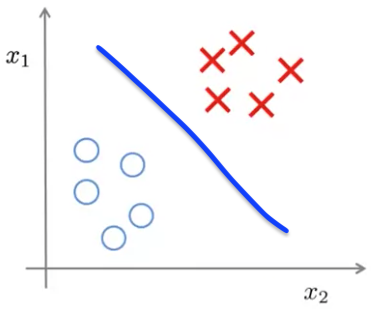
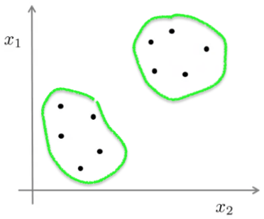

# Unsupervised Learning

In contrast to supervised learning, unsupervised learning we're given data that has no labels associated with it.

With supervised learning we would have a training set that is a set of pairs of labeled training data:
$$
\{(x^{(1)}, y^{(1)}), (x^{(2)}, y^{(2)}), (x^{(3)}, y^{(3)}), ..., (x^{(m)}, y^{(m)})\}
$$
The goal is to find a decision boundary (blue in the sketch below) that separates the positive and negative labeled examples. The problem that supervised learning solves for us is, given a a set of labels to fit an hypothesis to it.

With unsupervised learning we're given data that does not have any labels associated with it:
$$
\{x^{(1)}, x^{(2)}, x^{(3)}, ..., x^{(m)}\}
$$
We give this data to an algorithm and expect it to find some structure in the data for us. Here we see data plotted without labels and a clustering algorithm to identify groupings within the data.

