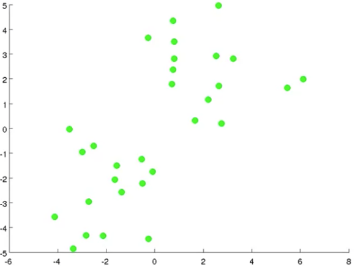
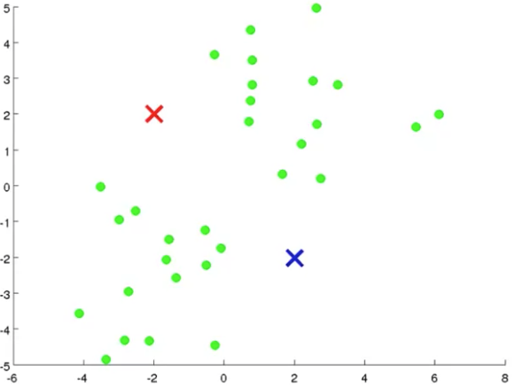
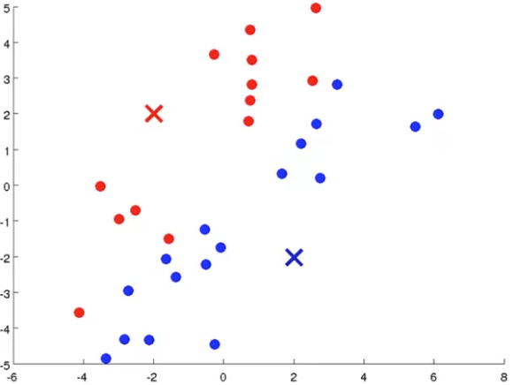
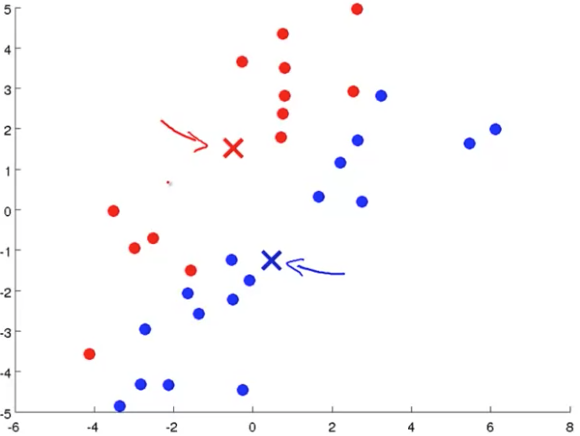
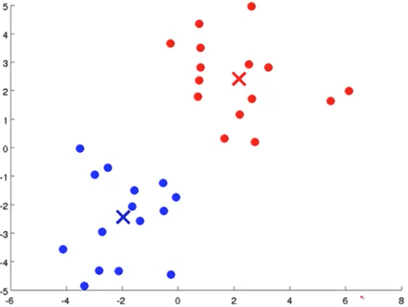
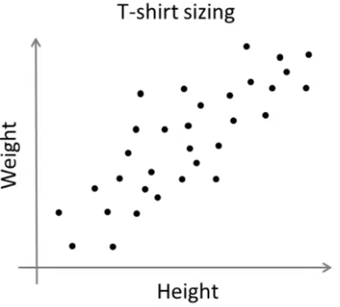
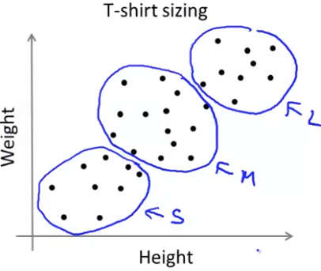

## K-Means Algorithm [^67]

In the clustering problem we are given an unlabeled dataset and we would like to have an algorithm automatically group the data into coherent subsets or into clusters for us.  The *K-Means algorithm* is by far the most popular and most widely used clustering algorithm.

Assume we're given a plot of a dataset and that we want to group the data into two clusters:

If we're going to run the K-Means clustering algorithm, the first step is to randomly initialize points called the *cluster centroids*.  Because we want to group the data into two clusters, we choose two points. In this diagram, they are the red and blue crosses.

K-Means is an iterative algorithm and it does two things iteratively:

1. Cluster assignment
2. Move the centroid

#### Cluster Assigment

This means it's going through each of the examples (the green dots) and depending on whether it's closer to the red or the blue cluster centroid, it's going to assign each of the data points to one of the two center centroids.  This is the cluster assignment step, and is illustrated here by each of the dots being colored according to the centroid it's closer to:

#### Move Centroid

Next we'll take the two cluster centroids — the red and blue crosses — and we are going to move them to the average of the points of the same color as the centroid.  In other words, we're going to look at all the red points and compute the mean of the location of all the red points and we're going to move the red centroid there.  And, then do the same for the blue cluster centroid and all the blue dots.  Here's the same data plotted with the cluster centroids moved to the mean location of it's data:

We then continuously do subsequent cluster assignment steps followed by a move centroid steps until the data converges around a centroid and doesn't vary much from them:

#### K-Means Algorithm

Given input $K$ (a number of clusters), and $\{x^{(1)}, x^{(2)}, ..., x^{(m)}\}$ (an unlabeled training set).  For k-means we assume that $x^{(i)}$ is an $\mathbb{R}^n$ vector and drop the $x_0=1$ convention.

1. Randomly initialize $K$ cluster centroids: $\mu_{1}, \mu_{2}, …, \mu_{K} \in \mathbb{R}^n$

2. Repeat:

   1. For each $i$ of $m$ training examples, $c^{(i)} :=$ index (from 1 to $K$) of cluster centroid closest to $x^{(i)}$ ($c$ is one of $K$ clusters).  In other words for each training example we want to minimize the distance to each of the cluster centroids:
      $$
      c^{(i)}= min \left( \left\Vert x^{(i)}-\mu_{k} \right\Vert \right)^2
      $$

   2. For each $k$ of $K$ cluster centroids, $\mu_k :=$ mean of points assigned to cluster $k$

If you end up in a scenario where a cluster is left with no points assigned to it, then we would eliminate that cluster and end up with $K-1$ cluster centroids.  If there's a need to have $K$ clusters, then we would assign that cluster to a new random location.

#### K-Means for Non-Separated Clusters

Example:

Let's say we want to assign these data points to S, M, and L clusters:

