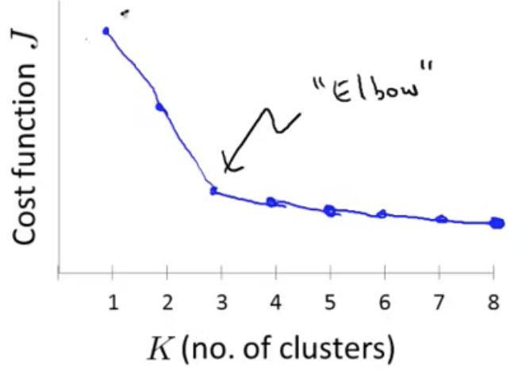
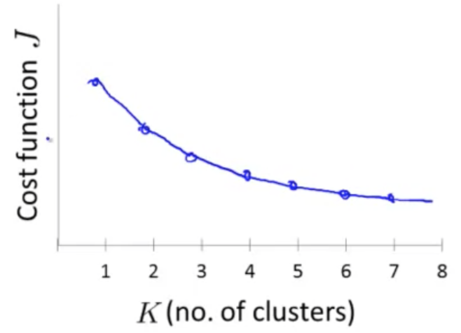
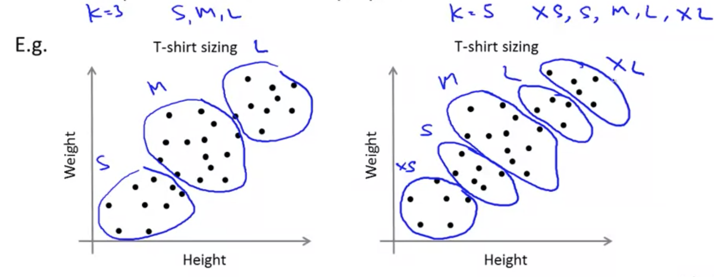

## Clustering: Choosing the Number of Clusters [^70]

There is no great way to automatically choosing the number of clusters ($K$).  The most common way of choosing the number of clusters is to do so manually by looking at visualizations or by looking at the output of the clustering algorithms, etc.

### Elbow Method

A common way of doing this is to use the _Elbow Method_.  To do so we run k-means with progressively increasing numbers of clusters and plot them against the cost function.   When doing this we end up with a curve that shows the distortion decreasing as a function of the number of clusters.  This curve may demonstrate a distinct point where the distortion decreases rapidly, and then slows down.  That point where it shifts is known as the elbow, and provides an indicator of how many clusters we should use:

As it happens, often this "elbow" doesn't present itself very clearly, and doesn't make it very clear how many clusters to choose.

The elbow method is worth a shot but it's not always going to give an answer.

### Choosing Based on Purpose

Very often people are running K-means in order to get clusters for some later purpose, or for some sort of downstream purpose.  For example, maybe you want to do market segmentation, or you're evaluating t-shirt sizes, etc.

If that gives you an evaluation metric that may be a better way to determine the number of clusters, to see how well different numbers of clusters serve that later, downstream purpose.

To use the example of t-shirt sizes, let say you run a business where you sell t-shirts and you're trying to understand how what different size shirts to make based on the size of your customers.  So, we choose K equals 3, then we might have S, M, & L T-shirts.  Or maybe, we want to choose K equals 5, and then we might have, you know, XS, S, M, L, XL T-shirt sizes.

So, if we run K-means with K equals 3 & K equals 5, we may end up with groupings like the below:

To choose, we can think about this from the perspective of the t-shirt business and ask "Well if I have five segments, then how well will my t-shirts fit my customers and so, how many t-shirts can I sell? How happy will my customers be?"  We would choose based on what makes the most sense from the perspective of the t-shirt business, in terms of whether we want to have more t-shirt sizes so that the shirts fit my customers better or do I want to have fewer sizes so that I make fewer sizes of t-shirts, and be able to sell them more cheaply to customers.

In this case, the t-shirt business would give you an evaluation metric you can use to decide how many clusters to rely on.
