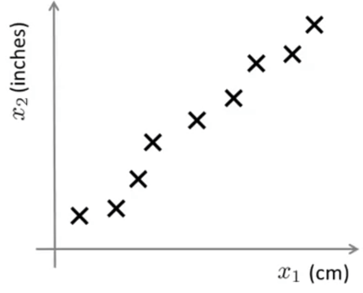
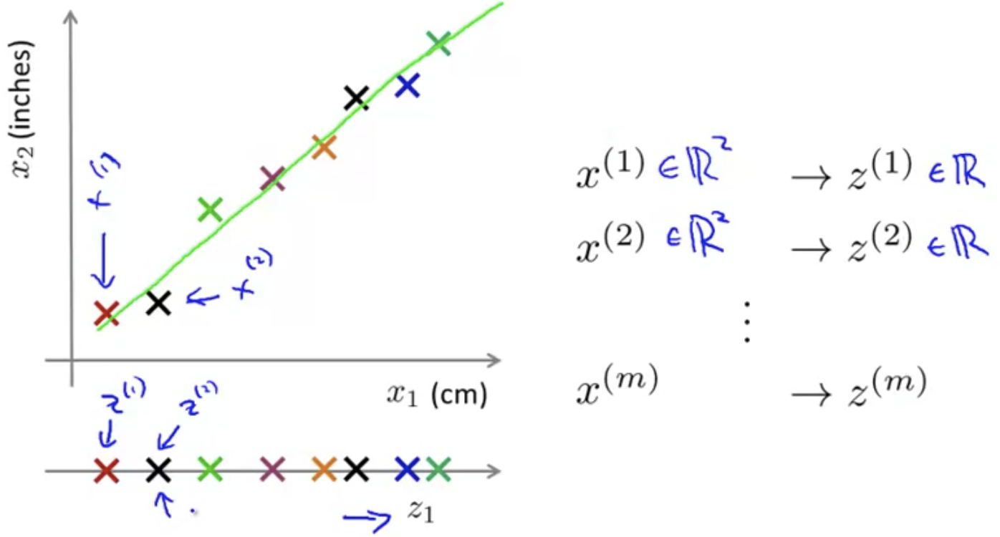
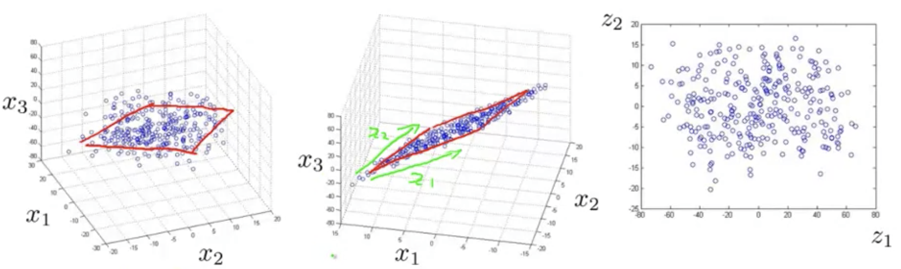

## Dimensionality Reduction

### Motivation I: Data Compression

There are a couple of different reasons why one might want to do dimensionality reduction.  One is data compression, which not only allows us to compress the data and have it therefore use up less computer memory or disk space, but it will also allow us to speed up our learning algorithms.

#### Reducing Data from 2D to 1D

Let's say we've created a dataset with many, many features. And let's say that unknown to us two of the features were actually the length of something in centimeters $x_1$, and a different feature, $x_2$, is the length of the same thing in inches.

So, this gives us a highly redundant representation and maybe instead of having two separate features $x1$ and $x_2$, both of which measure the length, maybe what we want to do is reduce the data to one-dimensional and just have one number measuring this length.

If you have hundreds or thousands of features, it is often this easy to lose track of exactly what features you have. And sometimes may have a few different engineering teams, maybe one engineering team gives you two hundred features, a second engineering team gives you another three hundred features, and a third engineering team gives you five hundred features so you have a thousand features all together, and if we can reduce the data to one dimension instead of two dimensions, that reduces the redundancy.

More generally, we'd like to approximate the original dataset by projecting all these examples onto a line then we'd have one number that represents multiple features in the original dataset.

#### Reducing Data from 3D to 2D

In this case we may have a dataset that is rougly lies on a 2D plane.  If we then project the data onto that surface, we would then only need two numbers to represent those values:

