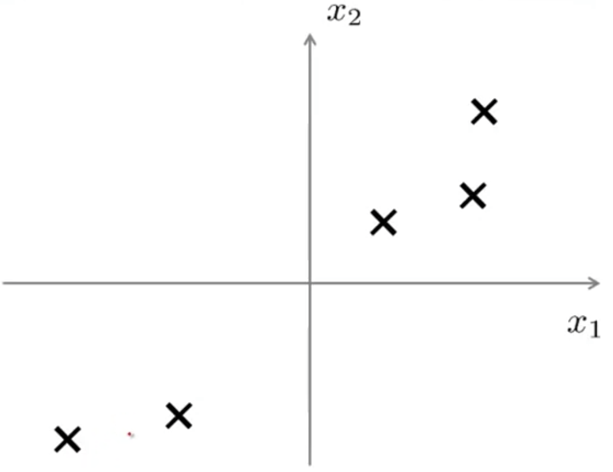
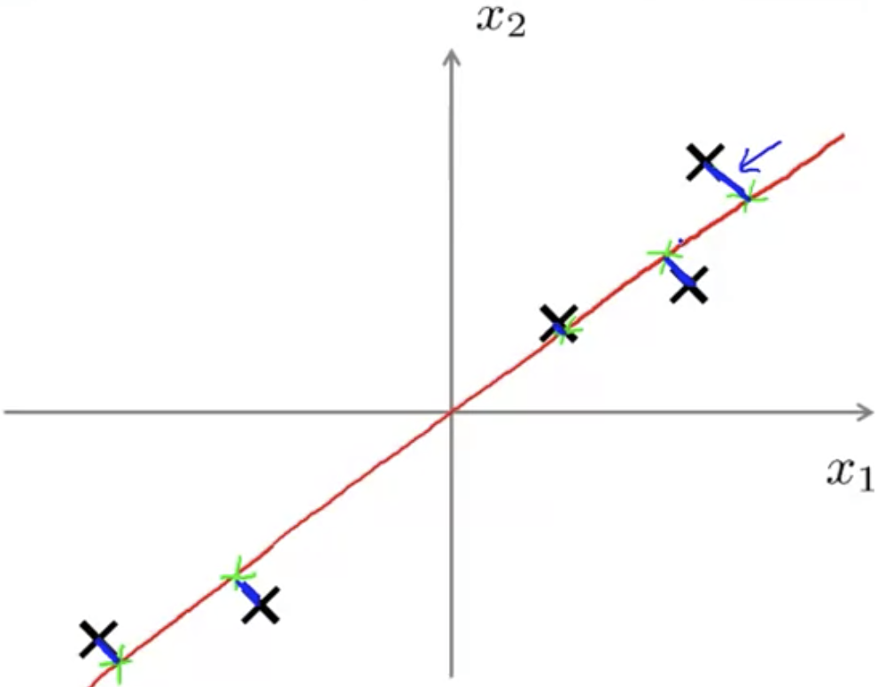
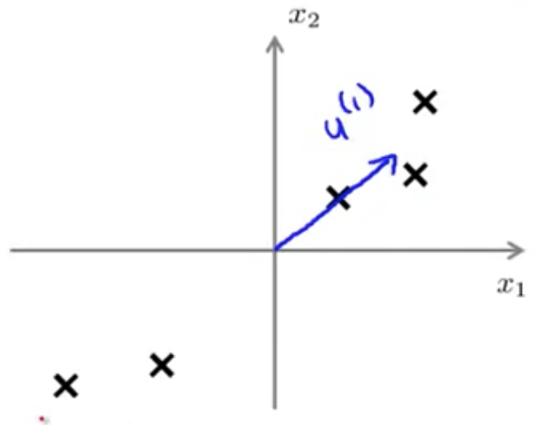
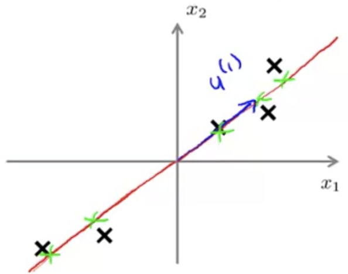

## Problem Formulation [^73]

For the problem of dimensionality reduction, by far the most commonly used algorithm is something called *principal components analysis*, or PCA.

Let's say we have a dataset like this, where we'd like to reduce the dimensions from 2D to 1D:

We can project (shown in green) each of the data elements onto a line (in red) where the distance (in blue) is minimized such that the sum of squares of this distance is minimized.

This is known as the _projection error_, and what PCA does is to find a lower dimensional surface so that the projection error is minimized.

### Problem of Principal Component Analysis

The goal of principal component analysis, in reducing data from $n$ to $k$ dimensions is to find $k$ lines (vector $u^{(1...k)} \in \mathbb{R}^n$).  For the case of compressing a 3D to a 2D space:

Such that, onto this line we can project the data so as to minimize the projection error:

### Comparison to Linear Regression

Although there are analogies to be seen when compared with linear regression, these are actually very different concepts.

With linear regression is trying to fit a straight line so as to minimize the squared error between each point and the line.  

In PCA it's trying to minimize the magnitude, or shortest orthogonal distances.  

More generally, in linear regression the goal is to predict $y$ given $x$. In PCA, there is no "special" variable $y$ that we're trying to predict by employing this method.  If we have 3D data and we're trying to reduce the data from 3D to 2D, then we have 3 features all considered equally, and there isn't some feature $y$ that we're seeking to derive.
