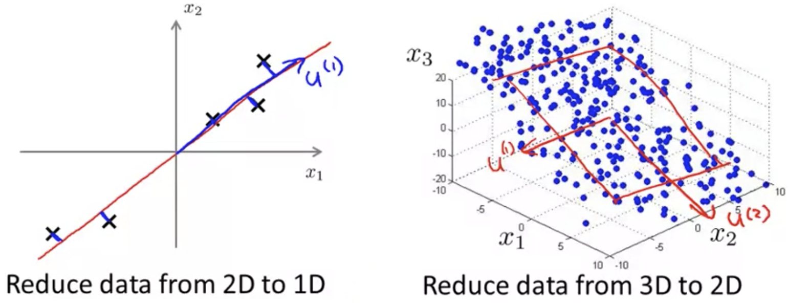

## Principal Component Analysis Algorithm [^74]

### Preprocessing

Before applying PCA on a data set, you must first preprocess the data by applying feature scaling and mean normalization.

So, given a dataset of unlabeled examples: $x^{(1)},x^{(2)},...x^{(m)}$ we calculate the mean for each feature:
$$
\mu_j=\frac{1}{m}\sum^m_{i=1}x^{(i)}_j
$$
We then replace each feature $x^{(i)}_j$ with its distance from the mean: $x_j-\mu_j$; this makes each feature have exactly zero mean.

If the different features are on different scales (e.g. $x_1$ is the size of the house and $x_2$ is the number of bedrooms), then we want to scale the features to have a comparable range of values.
$$
\frac{x^{(i)}_j-\mu_j}{s_j} \rightarrow x^{(i)}_j
$$
Where $s_j$ is some measure of the range of values for $x_j$, e.g. std deviation or max/min.

### Algorithm

We saw previously that what PCA does is to try to find a lower-dimensional subspace (red lines in below graphs) onto which it can project the data such that it minimizes the squared projection errors (blue lines between the × datapoints and the red lines). 



Specifically we want to find a vector $u^{(1)}$ (or, $u^{(1)}$ and $u^{(2)}$ in the 2D case), to define this surface onto which we will project the data.

And to be more specific about what we mean by reducing the data, given a set of data $x^{(i)}\in\mathbb{R}^2$ we want to transform that to $z^{(i)}\in\mathbb{R}$.  On the right we're converting  $x^{(i)}\in\mathbb{R}^3$ we want to transform that to $z^{(i)}\in\mathbb{R}^2$.  

So with PCA we need to compute two things:  the vectors $u^{(i)}$ and the numbers $z_i$.

#### Calculating the Subsurface $u$

It turns out that the mathematical derivation of this is beyond the scope of this course. But the procedure to find the value for $u^{(i)}$ is straightforward even though the proof is more involved.

So the procedure to reduce data from $n$-dimensions to $k$-dimensions is done by computing the "covariance matrix":
$$
\Sigma=\frac{1}{m}\sum^n_{i=1}(x^{(i)})(x^{(i)})^T
$$
We then compute the "eigenvectors" of matrix $\Sigma$ (shown here in variable: `Sigma`):

```octave
[U, S, V] = svd(Sigma);
```

`Sigma` is an $n×n$ matrix: note that $x^{(i)}$ is an $n×1$ matrix, and it is multiplied by its transpose, which is a $1×n$ matrix; therefore their product is $n×n$.

`svd` stands for Singular Value Decomposition (an advanced topic in linear algebra); you can also use the `eig` function in Octave. Its output is three matrices:  `U, S, V`.  The only one we use here is the `U` matrix. Also an $n×n$ matrix, it turns out its columns are exactly the vectors $[u^{(1)},…u^{(n)}]$ that we want. If we want to reduce the data down to $k$-dimensions, then we would just take the first $k$ vectors: $[u^{(1)},…u^{(k)}]$.  We refer to this sub-matrix as $u_{reduce}$.

#### Calculating the Reduced Dataset $z$

In order to get the value for $z$ we need to find a way to take our original dataset $x^{(i)} \in \mathbb{R}^n$ and find a lower-dimensional representation $z^{(i)} \in \mathbb{R}^k$.

The way to do that is to use the first $k$ columns from $U$ (i.e. $u_{reduce}$):
$$
z = u_{reduce}^T×x
$$
$u_{reduce}^T$ is a $k×n$ matrix and $x$ is a $n×1$ matrix. Their product results in a $k×1$ matrix.

### Summary

After mean normalization (i.e. ensure every feature has zero mean), and (optionally) feature scaling.  We calculate Sigma (here showing the vectorized implementation):
$$
\Sigma=\frac{1}{m}\sum^n_{i=1}(x^{(i)})(x^{(i)})^T\\
\downarrow \\
\Sigma = \left(\frac{1}{m}\right)×X^T×X
$$
Next we get `U` using $\Sigma$, grabbing the first $k$ columns, and multiplying them with the original dataset to get `z`:

```octave
[U, S, V] = svd(Sigma);
Ureduce = U(:,1:k);
z=Ureduce'*x;
```
