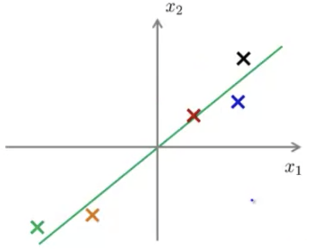
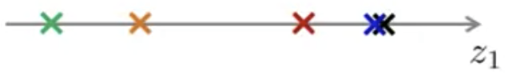
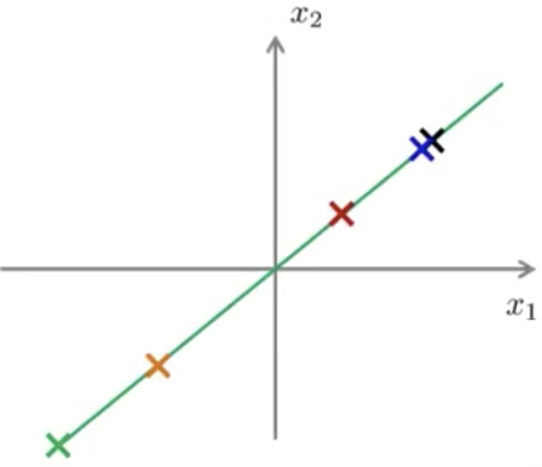

## Applying Principal Component Analysis [^75]

### Reconstruction from Compressed Representation

Given that we have a way to compress data from $n$ to $k$ dimensions, there is also a way to undo that and go back to an approximation of the original $n$-dimensional space.

Given a plot of a dataset $x$:

We can get to the compressed representation by:
$$
z=U^T_{reduce^{x}}
$$
Which would result in:

Then we can approximate $x$ by:
$$
x^{(1)}_{approx}=u_{reduce}\times z^{(1)}
$$
Where $u_{reduce}$ is an $n\times k$ vector and $z$ is a $k\times1$ vector resulting in $x_{approx}$ being an $n$-dimensional vector.

The approximated reconstruction of the original data then looks like this when plotted:

