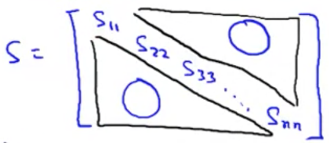

### Choosing the Number of Principal Components [^76]

When using the principal components algorithm we take $n$ dimensional features and reduce them to a representation of the features in $k$ dimensions.  This number $k$ is a parameter so of the algorithm, also known as the number of principal components that we've retained. What are some guidelines for choosing this number?

Some background concepts:

* PCA minimizes average squared projection error: $\frac{1}{m}\sum^{m}_{i=1} ||x^{(i)}-x^{(i)}_{approx}||^2$
* Total variation in the data: $\frac{1}{m}\sum^{m}_{i=1} ||x^{(i)}||^2$, how far on average are the training examples from zero.

Typically we want to choose $k$ to be the smallest value so that the ratio of minimized average squared projection error to the total variation in the data is less than 1%:
$$
\frac{\frac{1}{m}\sum^{m}_{i=1} ||x^{(i)}-x^{(i)}_{approx}||^2}{\frac{1}{m}\sum^{m}_{i=1} ||x^{(i)}||^2}\le0.01\ (1\%) \label{variance}
$$
"_99% of variance is retained_"

The range of values may be anywhere from 85-99%, with 95-99% being most common.

#### Algorithm for Choosing $k$

1. Start PCA with $k$ equal to one.
2. Compute $u_{reduce}, z^{(1)},..., z^{(m)}, x^{(1)}_{approx},..., x^{(m)}_{approx}$

3. Check if $\frac{\frac{1}{m}\sum^{m}_{i=1} ||x^{(i)}-x^{(i)}_{approx}||^2}{\frac{1}{m}\sum^{m}_{i=1} ||x^{(i)}||^2}\le0.01$

4. If it's not $\le0.01$, then increment $k$, and repeat steps 2 & 3.

This is quite laborious and inefficient.  However, when computing step 2, the `svd` function provides values that can be very useful.

```octave
[U, S, V] = svd(Sigma)
```

It turns out that the matrix `S` ($n \times n$) whose only non-zero elements are on the diagonal:



It's possible to show that for a given value of $k$, the ratio of projection error to total variance (see $\ref{variance}$ above) can be expressed as:
$$
1-\frac{\sum^{k}_{i=1}S_{ii}}{\sum^{n}_{i=1}S_{ii}}\le0.01
$$
This represents the ratio of the first $k$ elements of $S$ to the sum of all of the elements of $S$ and checking that it's less than 0.01.  When working this way, we only have to call `svd` one time, and then just loop over the values of $S$ to find $k$.
