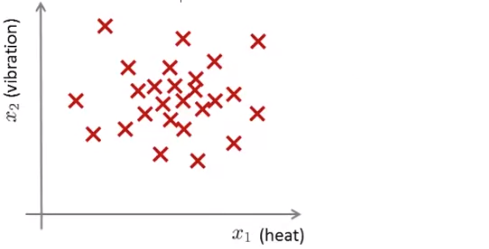
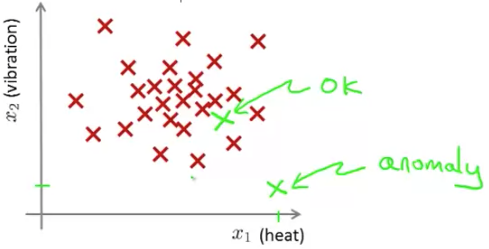
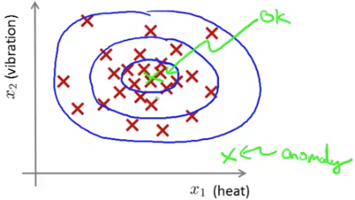

## Density Estimation [^78]

### Problem & Motivation

Let's say an airplane engine manufacturer does QA on engines as they come off the production line.  When doing so they measure out a set of features on each engine, for example:

* $x_1$ = heat generated by the engine
* $x_2$ = vibration intensity
* ...

This results in the dataset: $\{x^{(1)}, x^{(2)}, …, x^{(m)}\}$ that would look like this when plotted (where each red $\times$ represents a single engine):

Now, say, a new engine comes off the production line. We would like to know if this new engine is anomalous in any way — should this engine undergo further testing? or should we ship it to customers?

If the data for this new engine — $x_{test}$ — is consistent with engines that we've seen before, we might say it's okay.  However, if any of the features are inconsistent we would describe it as anomalous.

More formally, we're given some dataset and a new dataset, we would consider the first dataset is normal and we want to know if the new dataset is anomalous.  So, given an unlabeled training set we're going to build a model $p(x)$: the probability that some new example:
$$
p(x_{test})\lt\epsilon \rightarrow anomalous\\
p(x_{test})\ge\epsilon \rightarrow consistent
$$
So given a training set like that plotted, the model $p(x)$ will give progressively higher probability that the test data set (represented by green $\times$) is anomalous:

### Applications of Anomaly Detection

* Fraud Detection
  * By using features of a user's activities on a website, make a prediction of whether a new user behaves in a similar or in an unusual way.
* Manufacturing
* Monitoring computers in a data center
  * Example features: memory use, number of disk accesses per second, CPU load, CPU load/network traffic.
  * If these features are abnormal it might be an indicator that a machine is about to crash.