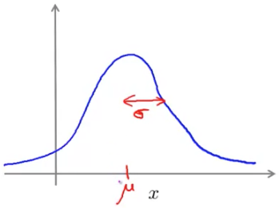
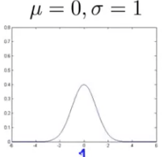
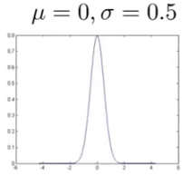
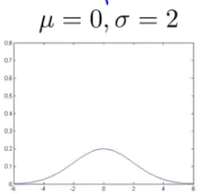
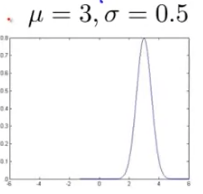
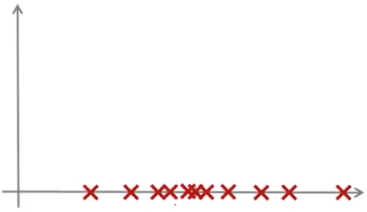

### Gaussian Distribution

Review of the Gaussian (aka "normal") distribution.

Let's say $x\in\mathbb{R}$. If the probability distribution of $x$ is Gaussian with mean $\mu$, variance $\sigma^2$ then this is written as:
$$
x\sim\mathcal{N}(\mu,\sigma^2)
$$
Which means "$x$ is distributed as a normal distribution parameterized by $\mu$ and $\sigma^2$".

If we plot the gaussian distribution it will look like the bell curve, whose center is $\mu$ and whose width (standard deviation) is $\sigma$.  It specifies that predictions that are closer to the mean are higher probability, which steadily decreases the further away from the mean the prediction is.

The formula for the gaussian distribution is:
$$
p(x;\mu, \sigma^2)=\frac{1}{\sqrt{2\pi}\sigma}exp\left(-\frac{(x-\mu)^2}{2\sigma^2}\right)
$$
When plotted it looks like this:

#### Some examples of Gaussian distributions

### Parameter Estimation

Given a dataset $\{x^{(1)}, x^{(2)}, …, x^{(m)}\}$ where  $x^{(1)}\in\mathbb{R}$, that when plotted look like this:

Let's say we suspect that these examples are distributed according to a normal distribution, as they are roughly clustered around one point ($\mu$) on the horizontal axis, with more distance between points as they move away.  However, I do not know what the mean or variance is.  

The standard formulas for estimating these parameters are:
$$
\mu=\frac{1}{m}\sum^{m}_{i=1}x^{(i)}
$$
Our estimate for the mean is just the average of our training set, giving us the center of the distribution.
$$
\sigma^2=\frac{1}{m}\sum^{m}_{i=1}\left(x^{(i)}-\mu\right)^2
$$
Our estimate for the variance relies on the mean we estimated above, and is just the average of the squared differences — also known as the *maximum likelihood estimation*.

