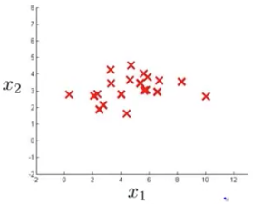
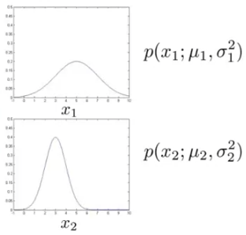
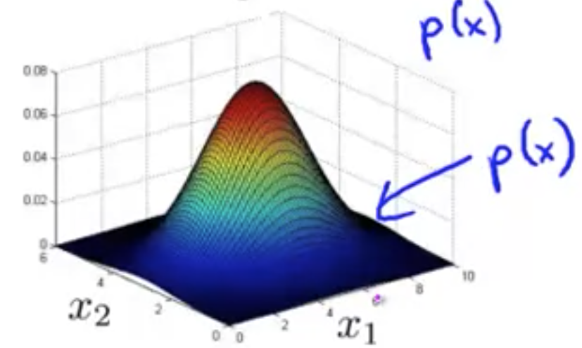
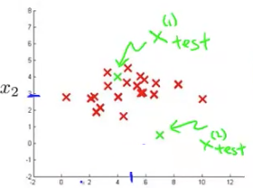
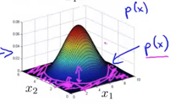
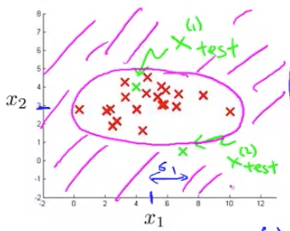

## Anomaly Detection Algorithm [^80]

Given what we know of the Gaussian distribution, let's apply that to develop an anomaly detection algorithm.

Given a dataset $\{x^{(1)}, x^{(2)}, …, x^{(m)}\}$ where  $x^{(1)}\in\mathbb{R}$, we want to model $p(x)$ to understand what are the high/low probability types of features.

As $x$ is a vector, we'll model $p(x)$ as the product of the probability of each feature:
$$
p(x) 
= p(x_1; \mu_1, \sigma^2_1) \times
p(x_2; \mu_2, \sigma^2_2) \times ... \times p(x_n; \mu_n, \sigma^2_n) \\
\downarrow\\
= \Pi^n_{j=1}p(x_j;\mu_j,\sigma^2_j)
$$
Putting all of this together the algorithm for anomaly detection is as follows:

1. Choose features $x_i$ that you think might be indicative of anomalous examples.
2. Given a training set $\{x^{(1)}, x^{(2)}, …, x^{(m)}\}$, fit parameters $\mu_1,…,\mu_n,\sigma^2_n$ by using the formulas for estimating the mean and the variance.
3. Given a new example $x_{test}$, compute $p(x_{test})$, and it's considered an anomaly if $p(x)\lt\epsilon$

#### Example of the Application of Anomaly Detection

Here's a plot of a dataset:

We can estimate, just by guessing from looking at the plot, that:
$$
\mu_1=5,\sigma_1=2\\
\mu_2=3,\sigma_2=1
$$
Based on those, the probability distributions for these features would look something like these:

And, from those two probabilities we would state that:
$$
p(x)=p(x_1; \mu_1, \sigma^2_1) \times p(x_2; \mu_2, \sigma^2_2)
$$
It turns out if we were to plot $p(x)$ as a surface plot it'd look something like this:

Where the height of above the surface at a particular point is the probability that the combination of those two features ($x_1 \& x_2$) is anomalous.

Now, let's say we have two new items that are to be tested, represented in green here and we want to determine whether they are anomalies.

Let's say we choose a value of $\epsilon=0.02$ and we compute $p(x^{(1)}_{test})$, and we find that it's 0.0426. As that's greater than $\epsilon$, then we can say that $x^{(1)}_{test}$ is not anomalous.  However, say we find that $p(x^{(2)}_{test})$ has a probability of 0.0021, which is much lower than $\epsilon$, then we'd want to reexamine that example as it's likely an anomaly.

What this 3D surface plot is saying is that all the points that are far above the surface has a high probability of being normal. In the plots below consider that there are regions, in magenta, where there's a high probability that the example is anomalous.  

