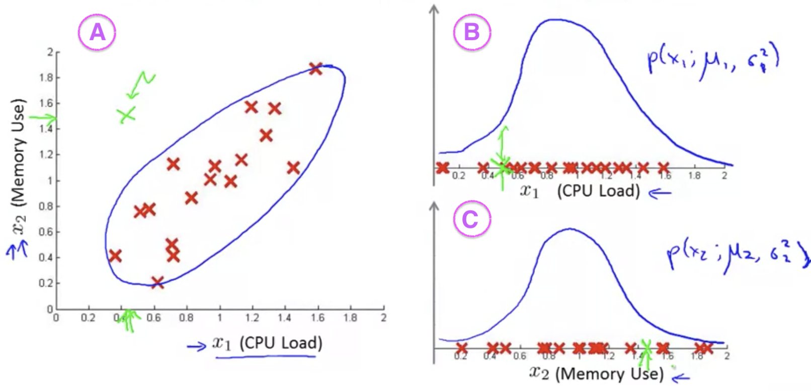
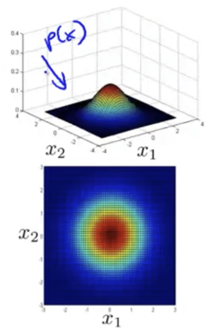
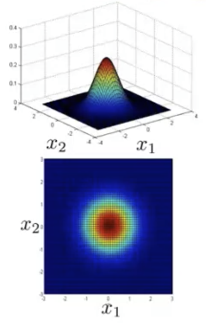
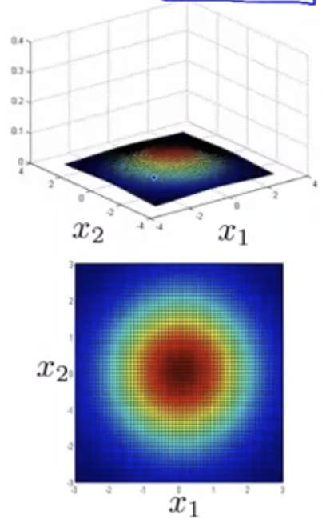
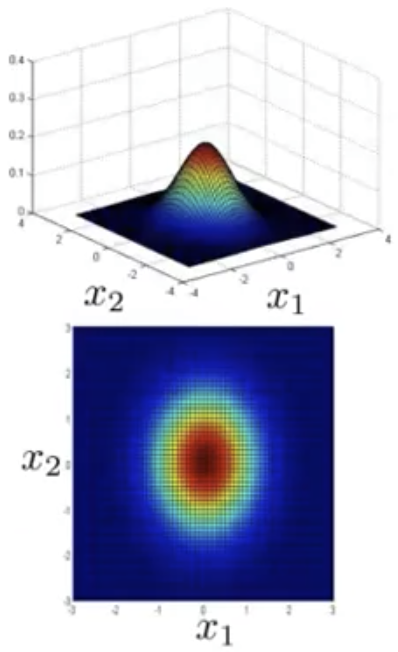
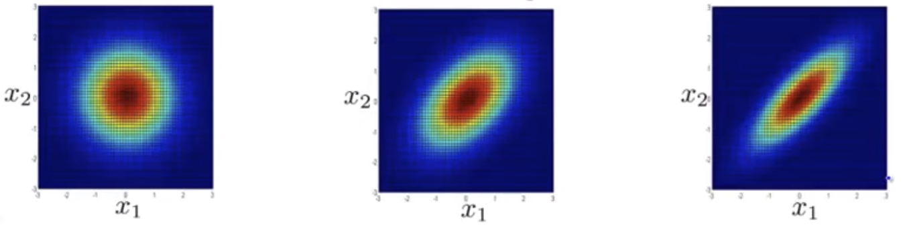
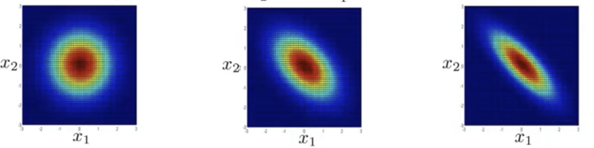
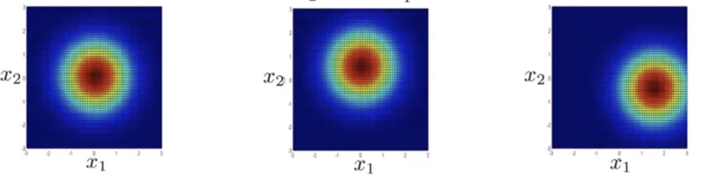

## Multivariate Gaussian Distribution [^84]

Multivariate Gaussian Distribution is an extenstion to the anomaly detection algorithm we've learned thus far that can sometimes catch anomalies that the earlier algorithm didn't.

### Motivating Example

To illustrate an example that can help us to understand an application for multivariate Gaussian distribution, consider a scenario where we're monitoring machines in a data center for anomalous behavior.

In the above set of graphs, we see training examples plotted in red and an anomalous example in green.

When considering plot A above, we see that the anomalous example is clearly beyond what we'd consider normal: judging from the other data, as CPU load increases, then memory use increases in a roughly linear fashion.  So, one would expect that $p(x)$ would be fairly low.

However, when we plot $x_1$ and $x_2$ as Gaussian distributions in B and C above, we see that when viewed in this way, as singular examples, then CPU and memory usage doesn't seem that far out of the ordinary from the other examples and the plots predict a fairly high $p(x)$: there are other examples that are either lower (in the case of $x_1$) or higher (when looking at $x_2$).

It's only when seen in combination with each other does this example present as an anomalous example.

### Applying Multivariate Gaussian Distribution

The way to address this issue is to not model $p(x_1), p(x_2), …$ separately, instead model $p(x)$ in one go. The distribution relies on two parameters: $\mu \in \mathbb{R}$, and $\Sigma\in\mathbb{R}^{n\times n}$ (also known as a covariance matrix).

The formula for Multivariate Gaussian Distribution is:
$$
\mathcal{N}(\mu\Sigma)=\frac{1}{(2\pi)^{\frac{n}{2}}|\Sigma|^{\frac{1}{2}}}exp\left(-\frac{1}{2}(x-\mu)^T\Sigma^{-1}(x-\mu)\right)
$$

* $|\Sigma|$ means the *determinate value* of sigma, and can be calculated with the `det` function in Octave.

#### Examples of a Multivariate Gaussian Distribution

Assuming as values for the mean and variance of a distribution of:
$$
\mu=\begin{bmatrix}0\\ 0\end{bmatrix} \\
\Sigma=\begin{bmatrix}1&0\\ 0&1\end{bmatrix}
$$
Here're two plots of $p(x)$ for those values:

So, for a specific value of $x_1$ and another for $x_2$ then the height at that location on the graph will give a value for $p(x)$ for that combination of features.  In the second plot, this probability is plotted as a variation in color.

To vary this example some, here we shrink the variance:
$$
\mu=\begin{bmatrix}0\\ 0\end{bmatrix} \\
\Sigma=\begin{bmatrix}0.6&0\\ 0&0.6\end{bmatrix}
$$
Then we see that the width of the cone diminishes, you end up with a narrower distribution whose height is taller:

In contrast, if we increase the variance:
$$
\mu=\begin{bmatrix}0\\ 0\end{bmatrix} \\
\Sigma=\begin{bmatrix}2&0\\ 0&2\end{bmatrix}
$$
Then the plot gets shorter and broader, indicating that the variability of $x_1$ and $x_2$ gets wider:

In this example we vary sigma by reducing the variance of $x_1$ while keeping the variance of $x_2$ the same.
$$
\mu=\begin{bmatrix}0\\ 0\end{bmatrix} \\
\Sigma=\begin{bmatrix}0.6&0\\ 0&1\end{bmatrix}
$$
In the plot, more clearly in the second plot, you can see that $x_1$ has a narrower characteristic compared to $x_2$

##### Modeling Correlations 

Correlations betwen features can be modeled with a multivariate normal distribution.  Here we see how, as we change the variance of $x_2$ we see how the shape of the distribution becomes progressively narrower, becoming more thinly peaked.  $x_1$ & $x_2$ tend to grow together, the things with large probability are the things where $x_1$ and $x_2$ are large or if they're both small
$$
\mu=\begin{bmatrix}0\\ 0\end{bmatrix} \\

\begin{aligned}[c]
\Sigma&=\begin{bmatrix}1&0\\ 0&1\end{bmatrix}
\end{aligned}
\ \ \ \ \ \

\begin{aligned}[c]
\Sigma&=\begin{bmatrix}1&0.5\\ 0.5&1\end{bmatrix}
\end{aligned}
\ \ \ \ \ \

\begin{aligned}[c]
\Sigma&=\begin{bmatrix}1&0.8\\ 0.8&1\end{bmatrix}
\end{aligned}
$$

In contrast if we change these variance values to be negative, then we get a model where the values are negatively correlated — $p(x)$ will be high if $x_1$ is low and $x_2$ is high & vice versa:
$$
\mu=\begin{bmatrix}0\\ 0\end{bmatrix} \\

\begin{aligned}[c]
\Sigma&=\begin{bmatrix}1&0\\ 0&1\end{bmatrix}
\end{aligned}
\ \ \ \ \ \

\begin{aligned}[c]
\Sigma&=\begin{bmatrix}1&-0.5\\ -0.5&1\end{bmatrix}
\end{aligned}
\ \ \ \ \ \

\begin{aligned}[c]
\Sigma&=\begin{bmatrix}1&-0.8\\ -0.8&1\end{bmatrix}
\end{aligned}
$$

##### Varying the Mean

As we vary the mean $\mu$, then the peak of the distribution will just shift around the center of the distribution.
$$
\Sigma=\begin{bmatrix}1&0\\ 0&1\end{bmatrix}
\\
\
\
\begin{aligned}[c]
\mu=\begin{bmatrix}0\\ 0\end{bmatrix}
\end{aligned}
\ \ \ \ \ \

\begin{aligned}[c]
\mu=\begin{bmatrix}0\\ 0.5\end{bmatrix}
\end{aligned}
\ \ \ \ \ \

\begin{aligned}[c]
\mu=\begin{bmatrix}1.5\\ -0.5\end{bmatrix}
\end{aligned}
$$

