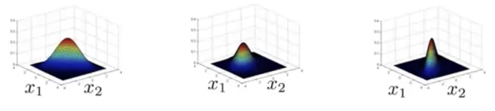

## Anomaly Detection using the Multivariate Gaussian Distribution [^85]

The multivariate normal distribution formula is paramterized by $\mu$ and $\Sigma$, whose formula is:
$$
p(x;\mu\Sigma)=\frac{1}{(2\pi)^{\frac{n}{2}}|\Sigma|^{\frac{1}{2}}}exp\left(-\frac{1}{2}(x-\mu)^T\Sigma^{-1}(x-\mu)\right)
$$
By varying $\mu$ and $\Sigma$ you can get a range of different distributions, as seen earlier:

### Parameter Estimation & Fitting

If we have a set of examples in a training set: \{\}, and we believe the examples come from a multivariate normal distribution, how do we estimate the values of $\mu$  and $\Sigma$?

As [described earlier](machine-learning/16-anomaly-detection/02-gaussian-distribution.md) the standard formula for estimating these values is to first estimate the value of $\mu$ as follows:
$$
\mu=\frac{1}{m}\sum^{m}_{i=1}x^{(i)}
$$
And, then we use that value for mean to derive the value for variance.  For a multivariate normal distribution, however, we'd use this formula to arrive at the value for $\Sigma$:
$$
\Sigma=\frac{1}{m}\sum^{m}_{i=1}\left(x^{(i)}-\mu\right)\left(x^{(i)}-\mu\right)^T
$$

#### Steps

1. Fit model $p(x)$ by setting
   $$
   \mu=\frac{1}{m}\sum^{m}_{i=1}x^{(i)} \\
   \Sigma=\frac{1}{m}\sum^{m}_{i=1}\left(x^{(i)}-\mu\right)\left(x^{(i)}-\mu\right)^T
   $$
   

2. Given a new example $x$, compute
   $$
   p(x)=\frac{1}{(2\pi)^{\frac{n}{2}}|\Sigma|^{\frac{1}{2}}}exp\left(-\frac{1}{2}(x-\mu)^T\Sigma^{-1}(x-\mu)\right)
   $$
   

   * Flag an anomaly if $p(x)\lt\epsilon$

### Relationship of the different Gaussian Distributions

Given the model for anomaly detection using a normal distribution:
$$
p(x) 
= p(x_1; \mu_1, \sigma^2_1) \times
p(x_2; \mu_2, \sigma^2_2) \times ... \times p(x_n; \mu_n, \sigma^2_n)
$$
It turns out that there's a mathematical relationship between this model and the one for a multivariate normal distribution: the normal distribution is a special case of the multivariate normal distribution where the contours of the Gaussian are always axis-aligned.

So, the models for both distributions are actually the same, with there being a constraint on the non-multivariate model where the covariant matrix $\Sigma$ must have zeroes on the off-diagonal entries in the matrix:
$$
\Sigma=\begin{bmatrix}\sigma^{2}_{1} &0&0&0\\ 0&\sigma^{2}_{2} &0&0\\ 0&0&\ddots &0\\ 0&0&0&\sigma^{2}_{n} \end{bmatrix}
$$
Therefore the original model is just a special case of the multivariate model.

#### When to use the multivariate model

Even though they're fundamentally the same there are places where using one or the other can be important.

| Original Model                                               | Multivariate Model                                           |
| ------------------------------------------------------------ | ------------------------------------------------------------ |
| Manually create features to capture anomalies where $x_1$, $x_2$ take unusual combinations of values. | Automatically captures correlations between features.        |
| Computationally cheaters, scales better to large values of $n$. | Computationally more expensive.                              |
| Works OK even if $m$ (training set size) is small            | Must have $m\gt n$ or else $\Sigma$ is non-invertible. Use only if $m$ is much greater than $n$ (e.g. $\gt 10n$) |
