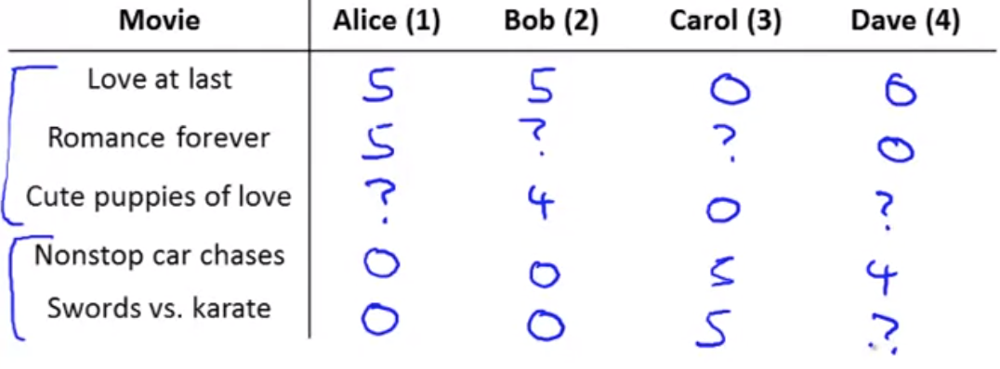

## Predicting Movie Ratings

### Problem Formulation

A user rates movies from zero to five stars.  Assuming this as a dataset (where $?$ means that the user did not watch/rate the movie):

And the following notation:

* $n_u$=the number of users

* $n_m$=number of movies

* $r(i,j)=1$ if user $j$ has rated movie $i$

* $y(i,j)$=the rating (0-5) given by user $j$ to movie $i$ (defined only if $r(i,j)=1$)

Given this dataset, come up with a learning algorithm that can be used given this data and try to predict the values that are missing (set to $?$), in other words find movies that the person has not watched that they may like.
