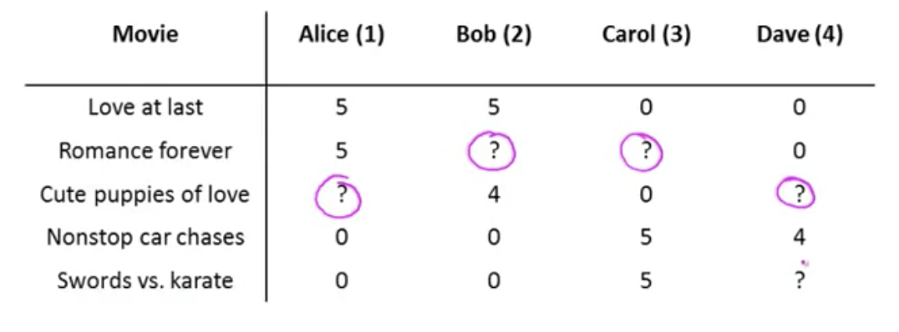

### Content Based Recommendations

A first approach to predicting a movie that has not yet been rated yet is known as _content based recommendations_.  These are known as content-based because we assume that we have available to us features for the different movies, where features that capture what is the content of these movies, of how romantic is this movie, how much action is in this movie. And we're really using features of a content of the movies to make our predictions.

Given a data set where some movies have not been rated by each of the users:

And, where $n_u=4$ and $n_m=5$.  Also suppose we have a set of features for this dataset: 

$x_1$ which rates on a scale of 0-1 of how much the movie is a romance movie, and $x_2$ that rates how much the movie is an action movie:

| #    | Movie                | $x_1$ (Romance) | $x_2$ (Action) |
| ---- | -------------------- | --------------- | -------------- |
| 1    | Love at Last         | 0.9             | 0.0            |
| 2    | Romance Forever      | 1.0             | 0.01           |
| 3    | Cute Puppies of Love | 0.99            | 0.0            |
| 4    | Nonstop Car Chases   | 0.1             | 1.0            |
| 5    | Swords vs. Karate    | 0.0             | 0.9            |

Then for each movie we develop a vector of features, $n=2$ that describe the movie, with an additional feature for $x_0$ of 1:
$$
movie_{1}=\begin{bmatrix}1\\ 0.9\\ 0\end{bmatrix} \\
movie_{2}=\begin{bmatrix}1\\ 1.0\\ 0.01\end{bmatrix} \\
movie_{3}=\begin{bmatrix}1\\ 0.99\\ 0.0\end{bmatrix} \\
movie_{4}=\begin{bmatrix}1\\ 0.1\\ 1.0\end{bmatrix} \\
movie_{5}=\begin{bmatrix}1\\ 0.0\\ 0.9\end{bmatrix} \\
$$
We can treat the ratings of each user as a separate linear regression problem.  So, for each user $j$, learn a parameter $\theta^{(j)}\in\mathbb{R}^{n+1}$, then predict user $j$ as rating movie $i$ with $(\theta^{(j)})^Tx^{(i)}$ stars.

Suppose we've learned that parameter for user 1 (Alice): $\theta^{(1)}=\begin{bmatrix}0\\ 5\\ 0\end{bmatrix}$, and if we want to predict a rating for $movie_3$ for her, then we'd calculate the product of the parameter for this user and the vector of features for that movie: $(\theta^{(1)})^Tx^{(3)}$.  The inner product of those two vectors is $5\times0.99=4.95$.

### Problem Formulation

More formally:

* $r(i,j)=1$ if user $j$ has rated a movie $i$, 0 otherwise.

* $y^{(i,j)}=\{ 0-5 \}$ a rating by user $j$ on movie $i$ , if defined.

* $\theta^{(j)}$ parameter vector for user $j$

* $x^{(i)}$ feature vector for movie $i$

* Then, for user $j$, movie $i$, the predicted rating is $(\theta^{(j)})^Tx^{(i)}$

* $m^{(j)}$ is the number of movies rated by user $j$.

  

  Given the above the goal is to learn $\theta^{(j)}$: choose a parameter vector theta J such that the predicted values are as close as possible to the values we see in our training set:
  $$
  \min_{\theta^{(j)}} = \frac{1}{2m^{(j)}}\sum_{i:r(i,j)=1}\left((\theta^{(j)})^T(x^{(i)})-y^{(i,j)} \right)^2+\frac{\lambda}{2m^{(j)}}\sum_{k=1}^{n}\left( \theta^{(j)}_{k} \right)^2
  $$

  * In order to learn these parameters we want to sum over all movies that a user has rated the computation of the user's predicted rating ($\theta$) on a particular movie ($x$) less the actual observed rating ($y$).  We can also add in a regularization term ($\lambda$) calculated over all of the parameters (except the bias term ($\theta^{(0)}$))
  * The division by the number of movies ($m^{(j)}$), being a constant, can be removed without affecting the final result.
  * Squared error term: $\frac{1}{2}\sum_{i:r(i,j)=1}\left((\theta^{(j)})^Tx^{(i)}-y^{(i,j)} \right)^2$
  * Regularization term: $\frac{\lambda}{2}\sum_{k=1}^{n}\left( \theta^{(j)}_{k} \right)^2$

### Optimization Objective

 To restate, our opimization objective for a single user:
$$
\min_{\theta^{(j)}} \frac{1}{2}\sum_{i:r(i,j)=1}\left((\theta^{(j)})^Tx^{(i)}-y^{(i,j)} \right)^2+\frac{\lambda}{2}\sum_{k=1}^{n}\left( \theta^{(j)}_{k} \right)^2
$$
But for a large-scale system we would typically want to learn parameters for all users $\theta^{(1)},…,\theta^{(n_u)}$:
$$
\min_{\theta^{(1)},…,\theta^{(n_u)}} \frac{1}{2} \sum_{j=1}^{n_u}   \sum_{i:r(i,j)=1}\left((\theta^{(j)})^Tx^{(i)}-y^{(i,j)} \right)^2+\frac{\lambda}{2}\sum_{k=1}^{n}\left( \theta^{(j)}_{k} \right)^2
$$

* The difference here is only that we added a summation term to indicate that the result should be summed for all users $\sum_{j=1}^{n_u}$
* We will refer to this expression going forward as $J(\theta^{(1)},…,\theta^{(n_u)}$)

### Optimization Algorithm

Putting it all together, to actually do the minimization we would derive the gradient descent update to be:
$$
\begin{cases}k=0&\theta^{(j)}_{k} :=\  \theta^{(j)}_{k} -\alpha \sum^{}_{i:r(i,j)=1} \left( (\theta^{(j)} )^{T}x^{(i)}-y^{(i,j)})x^{(i)}_{k}\right)  \\ k\neq 0&\theta^{(j)}_{k} :=\  \theta^{(j)}_{k} \  -\alpha \left(\  \frac{\partial }{\partial \theta^{(j)}_{k} } J(\theta^{(1)},…,\theta^{(n_u)}) \right)\end{cases}
$$

* $\alpha$ is the learning rate
* We have slightly different cases for $k$ when it is zero or not, because our regularization term $\frac{\lambda}{2}\sum_{k=1}^{n}\left( \theta^{(j)}_{k} \right)^2$ regularizes only the values of $\theta^{(j)}_{k}$  when $k$ is not zero.
* These are essentially the same expressions as used for linear regressions, except we've removed the constant for the $\frac{1}{m^{(j)}}$ term because we got rid of it when deriving the expression above.

### Conclusion

For many movies, we don't actually have, or maybe it's very difficult to get, features that describe the movies we're trying to predict.

And so, in the next lesson, we'll start to talk about an approach to recommender systems that isn't content based and does not assume that we have someone else giving us all of these features for all of the movies in our data set.

